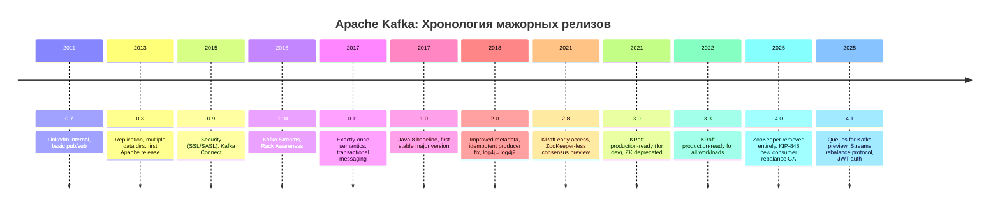

# Apache Kafka: Эволюция версий — от 0.7 до 4.1, хронология превращения эксперимента в стандарт индустрии

**Автор:** Chech  
**Дата:** 12 мая 2026  
**Тема:** Эволюция версий Apache Kafka  
**Рубрика:** 01 — History & Evolution  

---

## TL;DR

Эволюция Apache Kafka — это история превращения внутреннего эксперимента LinkedIn в индустриальный стандарт, прослеживаемая через 7 крупных мажорных вех (0.7 → 0.8 → 0.9 → 0.10 → 0.11 → 1.0 → 2.0 → 3.0 → 4.0) и десятки минорных релизов, выходящих каждые 4 месяца. Ключевая сюжетная дуга: от монолитной очереди сообщений (0.7, 2011) → к реплицированному распределённому логу (0.8, 2013) → к добавлению безопасности и Kafka Connect (0.9, 2015) → к Kafka Streams и exactly-once семантике (0.10–0.11, 2016–2017) → к стабилизации и экосистемной зрелости (1.x–2.x, 2017–2021) → к отказу от ZooKeeper в пользу KRaft и переосмыслению потребительского протокола (3.x–4.x, 2021–2026). Сегодня, на версии 4.1 (2025), Kafka — это не просто платформа потоковой обработки, а полноценная распределённая операционная система для данных, способная работать как очередь сообщений, потоковый процессор, шина событий и слой интеграции одновременно. В этой статье мы пройдём путь длиной в 15 лет, релиз за релизом.

---

## 1. Обзорная хронологическая таблица

| Версия | Дата выхода | Scala | Ключевые изменения |
|--------|------------|-------|---------------------|
| 0.7.0 | октябрь 2011 | — | Внутренний LinkedIn-релиз. Базовый pub/sub |
| 0.8.0 | декабрь 2013 | 2.10 | Репликация, множественные data-директории, асинхронная обработка запросов, первый Apache-релиз |
| 0.8.1 | март 2014 | 2.10 | Исправление багов репликации, авто-создание топиков |
| 0.8.2 | февраль 2015 | 2.10 | Новый Java producer, Quotas |
| 0.9.0 | ноябрь 2015 | 2.11 | SSL/SASL аутентификация, Kafka Connect, новый Consumer API |
| 0.10.0 | май 2016 | 2.11 | Kafka Streams, Rack Awareness, временные метки сообщений |
| 0.10.1 | октябрь 2016 | 2.11 | Streams улучшения, Consumer Group командная строка |
| 0.10.2 | февраль 2017 | 2.11 | JMX-метрики для Connect, Streams queryable state |
| 0.11.0 | июнь 2017 | 2.11 | **Exactly-once семантика**, транзакционные сообщения, idempotent producer |
| 1.0.0 | ноябрь 2017 | 2.11 | Java 8 baseline, удаление старого Scala-клиента |
| 1.1.0 | март 2018 | 2.11 | Controller-фейловер, динамический broker config |
| 2.0.0 | июль 2018 | 2.11 | Улучшенные метаданные, SSL-включено по умолчанию для inter-broker |
| 2.1.0 | ноябрь 2018 | 2.12 | ZStandard-сжатие, улучшенный лидер-балансировщик |
| 2.2.0 | март 2019 | 2.12 | Consumer group-aware metrics, SSL performance improvements |
| 2.3.0 | июнь 2019 | 2.12 | Kafka Connect incremental cooperative rebalancing |
| 2.4.0 | декабрь 2019 | 2.12 | Fetch from follower (KIP-392), MirrorMaker 2.0, Sticky Partitioner |
| 2.5.0 | апрель 2020 | 2.12 | TLS 1.3, Metrics на уровне топиков |
| 2.6.0 | август 2020 | 2.13 | KRaft ранний прототип, Java 11 для инструментов |
| 2.7.0 | декабрь 2020 | 2.13 | KRaft улучшения, Envelope encryption для Connect |
| 2.8.0 | апрель 2021 | 2.13 | **KRaft Early Access**, удаление ZooKeeper из документации как обязательного |
| 3.0.0 | сентябрь 2021 | 2.13 | KRaft production-ready (для dev-сред), ZooKeeper deprecated |
| 3.1.0 | январь 2022 | 2.13 | KRaft: JBOD support, делегирование токенов |
| 3.2.0 | май 2022 | 2.13 | KRaft: controller quorum online reconfiguration |
| 3.3.1 | октябрь 2022 | 2.13 | **KRaft production-ready для всех нагрузок** |
| 3.4.0 | январь 2023 | 2.13 | KRaft: миграция из ZooKeeper режима, ARM64 поддержка |
| 3.5.0 | июнь 2023 | 2.13 | KRaft: миграция из ZK с помощью kafka-metadata-quorum |
| 3.6.0 | сентябрь 2023 | 2.13 | Tiered Storage (Early Access), Delegation Tokens |
| 3.7.0 | февраль 2024 | 2.13 | JBOD в KRaft production-ready, Async Consumer API |
| 3.8.0 | июль 2024 | 2.13 | GraalVM native image support, new Rebalance protocol preview |
| 3.9.0 | октябрь 2024 | 2.13 | Удаление MirrorMaker 1, Share Groups preview |
| **4.0.0** | **март 2025** | **2.13** | **ZooKeeper полностью удалён**, KIP-848 GA, Queues for Kafka Early Access, Java 17 для брокеров |
| **4.1.0** | **август 2025** | **2.13** | **Queues for Kafka Preview**, Streams Rebalance Protocol (KIP-1071), JWT Bearer аутентификация (KIP-1139) |

---

## 2. Глубокая эпоха: 2007–2011 — до открытого кода

До того как стать Apache-проектом, Kafka существовала внутри LinkedIn как внутренняя разработка. Важно понимать, что нумерация версий начинается не с 0.1, а сразу с 0.7 — потому что внутри LinkedIn уже было шесть итераций, которые тестировались и отбрасывались в 2007–2010 годах.

**Что происходило в эти «тёмные» годы (версии 0.1–0.6):**

- Система изначально писалась на Scala Джейм Крепсом и его командой как «распределённый лог» для агрегации логов активности пользователей
- Первые версии были настолько сырыми, что не имели даже репликации — данные хранились в единственном экземпляре на диске одного брокера
- Producer API представлял собой тонкую обёртку над сокетами: никаких гарантий доставки, никаких сериализаторов
- Consumer API был ещё проще: pull-based модель с offset-ами, хранившимися прямо в ZooKeeper (который был в LinkedIn обязательным слоем инфраструктуры)
- Партиционирование появилось не сразу — в самых ранних прототипах топик был единым файлом на диске

**Ключевое архитектурное решение этих лет**: осознание, что диск не враг, а союзник. В то время как все очереди сообщений боролись за in-memory скорость, команда LinkedIn поняла, что современные диски с их пропускной способностью в сотни мегабайт в секунду и возможностью последовательного чтения на порядки быстрее случайного — идеальный носитель для append-only лога. Это решение — хранить всё на диске и никогда не удалять по факту потребления — стало ДНК Kafka на все последующие версии.

---

## 3. Эпоха 0.7–0.8 (2011–2014): от внутреннего инструмента к Apache-проекту

### 0.7.0 (октябрь 2011) — первый публичный релиз внутри LinkedIn

**Контекст**: LinkedIn открыл исходный код Kafka на GitHub в январе 2011 года. К октябрю кодовая база достаточно созрела, чтобы получить номер 0.7.0.

**Что было в коробке:**
- Базовый брокер с поддержкой топиков и партиций
- Простой Producer, отправляющий сообщения batch-ами
- Simple Consumer — pull-based, сам управлял смещениями через ZooKeeper
- Хранение данных: сегментированные лог-файлы на диске, ротация по времени или размеру
- ZooKeeper как внешний координатор: хранение метаданных, офсетов потребителей, информации о живущих брокерах

**Что отсутствовало:**
- Репликация: данные хранились ровно в одной копии. Сбой брокера означал потерю данных до восстановления с бэкапа (если бэкап вообще был)
- Аутентификация и авторизация
- Какая-либо изоляция между клиентами

**Итог**: 0.7 — это proof-of-concept уровня «работает, но только в тестовой среде». LinkedIn использовал её в продакшене, но с огромным количеством ручного мониторинга и отсутствием гарантий сохранности.

### 0.8.0 (декабрь 2013) — настоящий Apache-релиз, эпоха репликации

Этот релиз — первая версия, которую можно называть production-grade. Принципиальное изменение: **внутрикластерная репликация (KAFKA-50)**.

**Ключевые нововведения 0.8.0:**

1. **Репликация**: каждый партишн получил лидера и набор реплик (in-sync replicas, ISR). Лидер принимал все записи и реплицировал их на фолловеров. Если лидер падал, новый лидер избирался из числа ISR. Это — фундамент, на котором построена вся последующая надёжность Kafka. Механизм «in-sync replicas» был инженерным прорывом: вместо кворумной репликации (как в ZooKeeper или etcd), где запись должна подтвердить большинством, Kafka требовала подтверждения только от узлов, которые фактически «догоняют» лидера. Это дало низкую латентность ценой более слабых гарантий (зато при сбое узла он просто исключался из ISR).

2. **Множественные data-директории (KAFKA-188)**: брокер получил возможность хранить партиции на разных физических дисках. Это позволило горизонтально масштабировать дисковый ввод-вывод: разные партиции разных топиков можно было разнести по разным spindle.

3. **Асинхронная обработка запросов (KAFKA-202)**: брокер перестал блокироваться на каждой операции и начал обрабатывать запросы асинхронно, что резко подняло пропускную способность.

4. **Внутренние метрики (KAFKA-203)**: первые встроенные метрики брокера — количество сообщений, байтов, ошибок.

**Что это значило для индустрии**: впервые появился инструмент, который сочетал пропускную способность (сотни мегабайт в секунду на брокере), долговременное хранение на диске (дни и недели) и репликацию «из коробки». RabbitMQ и ActiveMQ не могли соперничать по throughput, HDFS — по latency.

### 0.8.1 (март 2014) — стабилизация

Багфикс-релиз. Главное — устранение race condition при старте реплик, который мог привести к потере данных. Добавлена возможность автоматического создания топиков при первой записи (удобно для разработки, позже станет источником проблем в продакшене и будет рекомендовано отключать).

### 0.8.2 (февраль 2015) — новый Producer API и Quotas

- **Новый Java Producer (KIP-1)**: переписанный с нуля продюсер с пакетной отправкой (batch), асинхронным API на основе Future и полноценной обработкой ошибок. Старый Scala-продюсер был объявлен устаревшим.
- **Quotas**: первые механизмы ограничения пропускной способности на уровне client-id — защита от «шумного соседа».

---

## 4. Эпоха 0.9 (ноябрь 2015): безопасность и Kafka Connect

0.9.0 — эпохальный релиз по двум причинам: **безопасность и экосистемная интеграция**.

### Безопасность приходит в Kafka

До 0.9 любой, кто имел сетевой доступ к брокеру, мог читать и писать любые данные. 0.9 добавила:

- **SSL-шифрование**: защита данных на проводе
- **SASL-аутентификация**: PLAIN, GSSAPI (Kerberos), а позже SCRAM
- **ACL (Access Control Lists)**: управление доступом на уровне топиков и операций (read/write/describe/delete)

Это сделало Kafka пригодной для enterprise-внедрений и финансового сектора. До 0.9 ни один банк не стал бы рассматривать Kafka всерьёз.

### Kafka Connect — фреймворк интеграции

**Kafka Connect** стал встроенным фреймворком для подключения Kafka к внешним системам: базам данных, файловым хранилищам, поисковым индексам. Ключевая идея: вместо того чтобы каждый разработчик писал кастомный коннектор к каждой внешней системе, Kafka предоставила стандартный фреймворк, в котором нужно реализовать только логику чтения/записи данных.

Архитектура разделилась на Source Connectors (импорт данных в Kafka) и Sink Connectors (экспорт данных из Kafka). Connect взял на себя управление задачами, масштабирование, отказоустойчивость и хранение состояний — разработчику осталось только определить конфигурацию.

### Новый Consumer API

Старый consumer (называемый «simple» или «low-level») требовал от разработчика вручную управлять партициями, офсетами и обработкой ошибок. Новый consumer (KIP-31) ввёл:

- Consumer Groups: автоматическое распределение партиций между потребителями в группе
- Автоматическое управление офсетами с коммитом через ZooKeeper или внутренний топик `__consumer_offsets`
- Механизм rebalance при добавлении/удалении потребителей

### Изменение формата версионирования

С 0.8.x Kafka использовала трёхчастную нумерацию (0.8.0, 0.8.1, 0.8.2). С 0.9.0 формат стал четырёхчастным (0.9.0.0) — это отражало усложнение системы и наличие теперь уже трёх артефактов: core, clients и connect. Четырёхчастный формат продержался до 1.0.

---

## 5. Эпоха 0.10–0.11 (2016–2017): потоковая обработка и exactly-once

Эти два года — возможно, самые насыщенные в истории Kafka. За 18 месяцев проект прошёл путь от «распределённой очереди» до «потоковой платформы».

### 0.10.0 (май 2016) — Kafka Streams

**Kafka Streams** — это встроенная библиотека для потоковой обработки, которая превратила Kafka из транспортного слоя в вычислительный. Ключевое отличие от Spark Streaming или Flink: Kafka Streams — это не фреймворк с отдельным кластером, а **Java-библиотека**, встраиваемая в любое приложение. Вы запускаете Kafka Streams как часть вашего микросервиса, и он обрабатывает поток прямо из топика.

Что дал Kafka Streams в 0.10.0:
- Stateless операции: map, filter, flatMap
- Stateful операции: join, aggregate, windowing
- Интерактивные запросы (queryable state): возможность запрашивать состояние обработки напрямую, не обращаясь к внешней базе
- Локальное состояние хранилось в RocksDB (встроенной key-value базе), что делало каждый инстанс самодостаточным
- Отказоустойчивость через standby-реплики: при сбое инстанса его состояние восстанавливалось из changelog-топика

**Rack Awareness** (KIP-36): брокеры получили возможность назначать реплики с учётом физического расположения в дата-центре, минимизируя cross-rack трафик.

**Временные метки сообщений** (KIP-32): каждое сообщение получило поле timestamp — либо проставляемое продюсером, либо присваиваемое брокером в момент получения. Это фундамент для временных окон в Kafka Streams.

### 0.10.1 (октябрь 2016)

- Улучшения Kafka Streams API: оператор groupByKey, глобальные таблицы (GlobalKTables), тайм-аут сессий
- Консольная утилита `kafka-consumer-groups` для просмотра состояния групп, офсетов и лага

### 0.10.2 (февраль 2017)

- Kafka Streams: Queryable State API — возможность отправлять интерактивные запросы к состоянию обработки
- JMX-метрики для Kafka Connect: мониторинг статуса задач и коннекторов
- Улучшенная очистка логов (log compaction): оптимизация процесса удаления старых ключей

### 0.11.0 (июнь 2017) — Exactly-Once Semantics

**0.11.0 — это тектонический сдвиг в семантике доставки.**

До 0.11 Kafka предлагала at-least-once семантику: в случае сбоя сообщение могло быть доставлено повторно. Для потоковой обработки это означало, что операции типа «переведи деньги со счёта A на счёт B» могли быть выполнены дважды — неприемлемо для финансового сектора.

0.11.0 ввела три взаимосвязанных механизма:

1. **Idempotent Producer** (KIP-98): продюсер присваивает каждому сообщению уникальный sequence number. Брокер гарантирует, что в каждой партиции sequence numbers идут без пропусков. Повторно отправленное сообщение с тем же sequence number отбрасывается.

2. **Транзакции** (KIP-98 продолжение): продюсер может открыть транзакцию, отправить множество сообщений в разные топики и партиции, и атомарно закоммитить их. Транзакция либо видна полностью, либо не видна вообще. Изоляция «read committed» позволяет потребителю видеть только закоммиченные сообщения.

3. **Exactly-Once Streams**: Kafka Streams получила сквозную exactly-once семантику. При перезапуске после сбоя Streams-приложение атомарно коммитило и результат обработки, и смещение потребления — никаких дубликатов.

Эти изменения были колоссальны по сложности. Транзакционный протокол потребовал нового coordinator-а (похожего на group coordinator для consumer groups), нового системного топика `__transaction_state` и глубоких изменений в формате сообщений (добавление transactional id, producer epoch, sequence number в заголовки).

### 0.11.0.1–0.11.0.3 (сентябрь 2017 — апрель 2018)

Багфиксы: исправления гонок в транзакционном протоколе, утечек памяти в Kafka Streams, проблем с большими сообщениями.

---

## 6. Эпоха 1.x (ноябрь 2017 — июль 2018): стабильность и зрелость

Переход с 0.11 на 1.0 — это не технический, а маркетингово-психологический рубеж. «1.0» говорит индустрии: продукт стабилен, API заморожен, можно внедрять без страха. Нумерация также упростилась: с четырёхчастной (0.11.0.3) на трёхчастную (1.0.0).

### 1.0.0 (ноябрь 2017)

- **Java 8 становится минимальным требованием**: Java 7 больше не поддерживается
- Удаление старого Scala producer и consumer — все клиенты теперь используют новый Java API
- Поддержка Java 9 (экспериментально)
- Улучшена обработка больших сообщений (> 1MB): снижено потребление памяти на брокере
- Оптимизация использования дискового пространства: более эффективное сжатие индексов

### 1.0.1 (март 2018) и 1.0.2 (апрель 2018)

Багфикс-релизы: проблемы с SSL-переподключениями, memory leak в Streams, проблемы с большими fetch-запросами.

### 1.1.0 (март 2018)

- **Controller failover improvements**: ускорено переключение контроллера при сбое — критично для кластеров с десятками тысяч партиций
- **Динамическая переконфигурация брокеров**: изменение некоторых параметров без перезапуска (например, `log.retention.ms`, `unclean.leader.election.enable`)
- Удалены устаревшие ZooKeeper-пути для офсетов (переход на `__consumer_offsets` завершён)
- Улучшена изоляция контроллера: отдельный поток для метаданных, чтобы избежать deadlock'ов

---

## 7. Эпоха 2.x (июль 2018 — апрель 2021): экосистемный взрыв и взросление

2.x — самая длинная эпоха в истории Kafka (почти 3 года, 8 минорных версий). Это период, когда Kafka перестала быть «новой технологией» и стала «стандартным слоем» — примерно как TCP/IP для сетей.

### 2.0.0 (июль 2018)

- **Idempotent producer по умолчанию**: начиная с 2.0 продюсер идемпотентен by default (`enable.idempotence=true`), что даёт защиту от дубликатов без дополнительных настроек
- **Hostname verification включена для SSL**: защита от MITM-атак на inter-broker коммуникацию
- Улучшение метаданных: broker теперь кеширует информацию о топиках более агрессивно, снижая ZooKeeper-нагрузку
- Оптимизация контроллера при большом количестве топиков

### 2.1.0 (ноябрь 2018)

- **ZStandard сжатие** (KIP-110): добавлена поддержка ZSTD — алгоритма сжатия, дающего лучшее соотношение сжатия к скорости, чем GZIP или Snappy
- Улучшенный лидер-балансировщик: автоматическое перераспределение лидерства для выравнивания нагрузки между брокерами
- Java 11 support (экспериментально)
- Удаление поддержки Scala 2.11 (минимальная версия — Scala 2.12)

### 2.2.0 (март 2019)

- Consumer group-aware метрики брокера: видимость лага, скорости потребления по группам
- SSL performance improvements: снижение CPU overhead для SSL-коммуникаций
- Расширение AdminClient API: поддержка describe/list consumer groups, delete records

### 2.3.0 (июнь 2019)

- **Incremental Cooperative Rebalancing для Kafka Connect**: вместо stop-the-world ребалансировки, Connect получил постепенное перераспределение задач между worker'ами. Это драматически снизило задержки при масштабировании Connect-кластеров
- Улучшена работа с SASL/SCRAM
- Kafka Streams: InMemoryKeyValueStore для тестирования без RocksDB

### 2.4.0 (декабрь 2019) — экосистемный прорыв

2.4.0 — один из самых богатых на фичи минорных релизов.

- **Fetch from Follower (KIP-392)**: потребители могут читать с фолловер-реплик, а не только с лидера. В multi-datacenter деплойментах это позволяет читать из локального дата-центра, экономя cross-DC трафик и снижая латентность
- **MirrorMaker 2.0 (KIP-382)**: полностью переписанный движок кросс-кластерной репликации на базе Kafka Connect. Новые возможности: двунаправленная репликация, автоматическое переименование топиков, детекция циклов, сохранение офсетов между дата-центрами для failover
- **Sticky Partitioner (KIP-480)**: если продюсер не указывает ключ, новый партиционер группирует сообщения в более крупные batch'и (sticky), что даёт до 50% снижения латентности и 5–15% снижения CPU на продюсере
- **Incremental Cooperative Rebalancing для Consumer Groups (KIP-429)**: вместо eager rebalance (сброс всех партиций и полный пересчёт), потребители сохраняют свои партиции и постепенно перераспределяют только изменённые. Критически важно для stateful приложений (Kafka Streams), сокращая время ребалансировки с минут до секунд
- Новый Java Authorizer Interface (KIP-504): асинхронные ACL-обновления, поддержка нескольких listener'ов, динамическая переконфигурация

### 2.5.0 (апрель 2020)

- **TLS 1.3 поддержка** (KIP-573)
- Добавление метрик на уровне отдельных топиков
- Улучшение обработки ошибок при unclean leader election
- Kafka Streams: улучшенный suppress-оператор, когерентная обработка временных окон

### 2.6.0 (август 2020) — первый заход на KRaft

- **KRaft: ранний прототип** (KIP-500, первая фаза): возможность запустить Kafka без ZooKeeper, используя внутренний Raft-протокол (основан на Raft consensus) для управления метаданными. KRaft в 2.6 — сугубо экспериментальный, только для разработки
- Java 11 становится минимальной версией для тулов
- Kafka Streams: новое API для Grace Period в оконных операциях
- Улучшения производительности: оптимизация выборки offset'ов

### 2.7.0 (декабрь 2020)

- **KRaft improvements**: поддержка нескольких контроллеров, улучшенная стабильность
- **Envelope encryption для Connect**: поддержка шифрования чувствительных полей в конфигурациях коннекторов
- Поддержка ARM64 (Apple M1) — экспериментально

### 2.8.0 (апрель 2021) — KRaft Early Access

- **KRaft Early Access**: ZooKeeper опциональный. Можно запускать брокеры в KRaft-режиме и постепенно мигрировать. Документация перестала требовать ZooKeeper as mandatory
- Удаление поддержки Java 8 (минимальная — Java 11)
- Удаление поддержки Scala 2.12 (минимальная — Scala 2.13)
- Kafka Streams: улучшенный rack-aware standby task assignor

---

## 8. Эпоха 3.x (сентябрь 2021 — октябрь 2024): прощание с ZooKeeper

3.x — это эпоха постепенного, но неумолимого ухода от ZooKeeper. Слоган эпохи: «KRaft is the future».

### 3.0.0 (сентябрь 2021)

- **KRaft production-ready для dev/test сред**: впервые можно запустить Kafka-кластер без ZooKeeper в средах разработки и тестирования. Продакшен пока требует ZK.
- **ZooKeeper объявлен deprecated**: явное предупреждение, что в будущем ZK будет удалён
- Удалена поддержка Java 8 для брокеров (оставлена для клиентов)
- Старый формат сообщений (pre-0.11) удалён

### 3.1.0 (январь 2022)

- **KRaft: поддержка JBOD** (Just a Bunch of Disks) — множественных data-директорий в KRaft-режиме
- KRaft: support for delegation tokens
- Удаление устаревших `--zookeeper` флагов из CLI-тулов (везде `--bootstrap-server`)

### 3.2.0 (май 2022)

- **KRaft: controller quorum online reconfiguration** — возможность изменять количество контроллеров без остановки кластера
- Поддержка Apple Silicon (ARM64/M1/M2) на уровне нативного кода
- Улучшенная обработка сжатия в Log Compaction

### 3.3.1 (октябрь 2022) — ключевой рубеж

**3.3.0 не был анонсирован из-за критического бага, обнаруженного после публикации артефактов.** 3.3.1 стал де-факто релизом.

- **KRaft production-ready для ВСЕХ нагрузок**: Kafka готова к продакшен-использованию без ZooKeeper. Это важнейшая точка в эволюции платформы — снято последнее ограничение на KRaft-режим
- Полный набор KRaft-фичей: controller quorum, JBOD, delegation tokens, миграция

### 3.4.0 (январь 2023)

- **KRaft: миграция из ZooKeeper**: официальная процедура перехода с ZK-кластера на KRaft без потери данных. Инструмент `kafka-metadata-quorum` для пошаговой миграции
- ARM64 поддержка — production-ready

### 3.5.0 (июнь 2023)

- Стабилизация миграции ZK → KRaft
- Улучшения производительности контроллера при тысячах топиков
- Kafka Streams: ProcessorContext, улучшенный suppression

### 3.6.0 (сентябрь 2023)

- **Tiered Storage Early Access** (KIP-405): возможность хранить старые сегменты лога в дешёвом объектном хранилище (S3, GCS, Azure Blob), а на локальных дисках брокеров — только горячие данные. Это меняет экономику хранения: вместо дорогих EBS-дисков — копеечный S3
- Делегирование токенов — production-ready

### 3.7.0 (февраль 2024)

- JBOD в KRaft — production-ready
- Async Consumer API: асинхронное API для работы с consumer group (на смену синхронному poll)
- Улучшения в обработке ошибок для транзакционного producer

### 3.8.0 (июль 2024)

- **GraalVM Native Image support**: возможность компилировать Kafka-приложения в нативные образы (native images). Это даёт драматическое ускорение запуска (с секунд до миллисекунд) и снижение потребления памяти — идеально для serverless и Kubernetes
- **New Rebalance Protocol Preview** (KIP-848): preview нового протокола ребалансировки потребителей, который заменит «stop-the-world» подход на непрерывный
- Улучшения производительности Kafka Connect

### 3.9.0 (октябрь 2024)

- **Удаление MirrorMaker 1**: полностью заменён MirrorMaker 2.0
- Share Groups Preview (KIP-932): ранний превью концепции «разделяемых групп» для реализации паттерна очереди (несколько потребителей делят сообщения в топике, каждое сообщение обрабатывается только одним потребителем)

---

## 9. Эпоха 4.x (март 2025 — настоящее время): ренессанс архитектуры 🚀

4.x — эпоха, в которой Kafka окончательно завершает трансформацию из «очереди + ZooKeeper» в «распределённую потоковую платформу с собственным консенсусом».

### 4.0.0 (март 2025) — Прощай, ZooKeeper

4.0.0 — **первая версия, которая работает исключительно на KRaft**. ZooKeeper полностью удалён из кодовой базы. Это крупнейшее архитектурное изменение со времён 0.8 — и величайшее упрощение операционной модели за всю историю проекта.

**Ключевые изменения 4.0.0:**

- **KRaft mode по умолчанию и единственный режим**: ZK-режим отсутствует. Развёртывание становится тривиальным: `kafka-storage.sh format` — и кластер готов
- **KIP-848: New Consumer Rebalance Protocol — GA**: полностью новый протокол ребалансировки потребительских групп. Старый протокол требовал остановки потребления на время ребалансировки (stop-the-world). Новый — непрерывный, без остановки. Серверная сторона включена по умолчанию, клиенты опционально (`group.protocol=consumer`)
- **KIP-932: Queues for Kafka — Early Access**: концепция Share Groups, позволяющая реализовать паттерн point-to-point очереди поверх топиков Kafka. Каждое сообщение потребляется только одним участником группы — классический queue, а не pub/sub. Это расширяет применимость Kafka на use case'ы, где традиционно использовались RabbitMQ или SQS
- **KIP-890 Phase 2: Transactions Server-Side Defense**: защита от зомби-транзакций при сбоях продюсера
- **KIP-966: Eligible Leader Replicas (Preview)**: подмножество ISR-реплик, гарантированно имеющих полные данные до high-watermark. Безопасно для лидерских выборов
- **KIP-996: Pre-Vote**: механизм «предварительного голосования» в KRaft для предотвращения излишних выборов лидера при временных сетевых разделах
- **Java 17 для брокеров, Connect и Tools**: минимальная версия Java для серверной стороны повышена до 17. Клиенты и Streams требуют Java 11
- **KIP-896: удаление старых версий клиентского протокола**: минимальная версия клиента для коммуникации с 4.0-брокером — 2.1
- **Log4j → Log4j2 (KIP-653)**: завершён многолетний переход на современный фреймворк логирования

### 4.0.1 (сентябрь 2025) и далее

Багфикс-релизы. Критические исправления в KRaft-контроллере, транзакционном протоколе.

### 4.1.0 (август 2025) — эпоха очередей и переосмысления ребалансировки

- **Queues for Kafka — Preview (KIP-932)**: Share Groups переходят из Early Access в Preview. Уже можно тестировать, ещё не для продакшена
- **KIP-1071: Streams Rebalance Protocol**: полностью новый протокол ребалансировки для Kafka Streams. Вместо пересоздания всей топологии при добавлении/удалении инстанса, новый протокол постепенно перераспределяет задачи, сохраняя активное состояние на существующих инстансах. Это решает одну из старейших болей Kafka Streams: долгие ребалансировки в больших топологиях
- **KIP-1139: JWT Bearer аутентификация**: нативная поддержка JWT-токенов для аутентификации, без необходимости в Kerberos или внешних SASL-провайдерах. Критично для Cloud-native окружений и Service Mesh
- Улучшения безопасности: native OAuth2/OIDC integration, улучшенная обработка TLS
- Оптимизация производительности: снижение аллокаций в hot path брокера

### 4.1.1 (февраль 2026) и 4.1.2 (март 2026)

Багфикс-релизы. Критические исправления в новом потребительском протоколе и KRaft-контроллере.

### 4.2.0 — на горизонте

По состоянию на май 2026, 4.2 находится в разработке. Ожидаемые фичи:
- Queues for Kafka — Production Ready
- Дальнейшие улучшения Tiered Storage
- Возможность online-миграции между KRaft-контроллерами
- Оптимизации для ARM64-native окружений

---

## 10. Сквозные темы: что менялось сквозь все версии

### Формат сообщений

Одно из самых «дорогих» изменений в истории Kafka — эволюция формата сообщений:

- **0.7–0.8**: простой формат: key, value, CRC32 checksum
- **0.10**: добавлено поле timestamp
- **0.11**: добавлены transactional id, producer epoch, sequence number (для идемпотентности и транзакций)
- **2.0+**: record headers (KIP-82), гибкая сериализация с tagged fields
- **3.0**: удаление поддержки старого формата (pre-0.11)

Каждое изменение формата означало, что старые и новые версии клиентов и брокеров не могли общаться напрямую — требовался rolling upgrade с поддержкой двух форматов, что было серьёзной операционной нагрузкой.

### Модель версионирования

| Период | Формат | Пример | Примечание |
|--------|--------|--------|------------|
| 2011–2013 | 2-частный | 0.7, 0.8 | Внутренние/ранние Apache-релизы |
| 2015–2016 | 3-частный | 0.8.1, 0.8.2 | Появление минорных версий |
| 2015–2017 | 4-частный | 0.9.0.0, 0.11.0.3 | Усложнение артефактов (core + clients + connect) |
| 2017–наст. | 3-частный (SemVer) | 1.0.0, 4.1.0 | Стандартный семантический версионинг |

### Scala и Java: медленный отрыв от прошлого

Kafka родилась на Scala, но каждая мажорная версия двигалась в сторону «меньше Scala, больше Java»:

- **0.7–0.10**: Scala 2.10/2.11, Java 7
- **0.11**: Scala 2.11/2.12
- **1.0–2.0**: Scala 2.11/2.12, Java 8
- **2.1–2.5**: Scala 2.12, Java 8/11
- **2.6–2.8**: Scala 2.13, Java 11
- **3.0–3.9**: Scala 2.13, Java 11 (broker: 11)
- **4.0+**: Scala 2.13, Java 17 (broker: 17, clients: 11)

Тренд очевиден: Kafka движется от Scala к Java, от старых JVM к современным, и в перспективе — к GraalVM native images.

### Политика поддержки версий

Kafka придерживается неформальной политики: ~4 месяца на минорный релиз, одновременная поддержка до 3 минорных версий. После выхода новой минорной версии самая старая из поддерживаемых объявляется EOL. Это даёт пользователям примерно 12 месяцев на обновление.

### От ZooKeeper к KRaft: 10 лет эволюции консенсуса

| Этап | Версия | Статус ZooKeeper |
|------|--------|-----------------|
| Рождение | 0.7 (2011) | ZK — единственный координатор |
| Расцвет | 0.8–2.0 (2013–2018) | ZK — обязательный, стабильный |
| Первый уход | 2.6 (2020) | KRaft — экспериментальный прототип |
| Early Access | 2.8 (2021) | KRaft — опционально для тестов |
| Production (ограничено) | 3.0 (2021) | ZK deprecated, KRaft для dev |
| Production (полный) | 3.3 (2022) | KRaft production-ready |
| Миграция | 3.4–3.9 (2023–2024) | Пошаговая миграция ZK→KRaft |
| Полный уход | 4.0 (2025) | ZK удалён из кодовой базы |

Десятилетие зависимости от ZooKeeper было одновременно благословением (стабильный консенсус с проверенным кодом) и проклятием (сложность развёртывания, второй кластер для мониторинга, отдельный протокол безопасности, невозможность масштабирования метаданных выше определённого порога). KRaft решил все эти проблемы, пожертвовав «проверенностью» ZooKeeper.

---

## 11. Источники

1. **Apache Kafka Official Documentation** — раздел Release Notes и Upgrade Guides для каждой версии. https://kafka.apache.org/documentation/
2. **Apache Kafka Blog — Release Announcements**. https://kafka.apache.org/blog/releases/
3. **Apache Kafka 4.0.0 Release Announcement**. David Jacot, март 2025. https://kafka.apache.org/blog/2025/03/18/apache-kafka-4.0.0-release-announcement/
4. **Apache Kafka 4.1.0 Release Announcement**. Сентябрь 2025. https://kafka.apache.org/blog/2025/09/04/apache-kafka-4.1.0-release-announcement/
5. **What's New in Apache Kafka 2.4**. Apache Kafka Blog, декабрь 2019. https://blogs.apache.org/kafka/entry/what-s-new-in-apache1
6. **Kafka Version History: A Comprehensive Guide**. codestudy.net. https://www.codestudy.net/blog/kafka-version-history/
7. **Kafka's Evolution: From 0.7 to 3.8.0 and Key Innovations**. ECER Tech Topics, июль 2025. https://ecweb.ecer.com/topic/en/detail-28408-kafkas_evolution_from_07_to_380_and_key_innovations.html
8. **Apache Kafka Versions — Kinetic Edge**. https://www.kineticedge.io/resources/kafka-versions/
9. **Apache Kafka Versions — Neil Buesing's Blog**. https://www.buesing.dev/post/kafka-versions/
10. **Apache Kafka Release Notes (архив)** — все версии от 0.8.0 до 4.0.0. https://archive.apache.org/dist/kafka/
11. **Apache Kafka — endoflife.date**. https://endoflife.date/apache-kafka
12. **Apache Kafka — Wikipedia**. https://en.wikipedia.org/wiki/Apache_Kafka
13. **Kafka Improvement Proposals (KIPs)** — референсные страницы на Apache Confluence. https://cwiki.apache.org/confluence/display/KAFKA/Kafka+Improvement+Proposals
14. **Introducing Apache Kafka 4.1**. Confluent Blog, 2025. https://www.confluent.io/blog/introducing-apache-kafka-4-1/
15. **Kafka 4.1 Overview**. OpenLogic Blog. https://www.openlogic.com/blog/kafka-4-1-overview

---

*Следующая статья в треке: [03-design-decisions.md](./03-design-decisions.md) — Ключевые архитектурные решения Apache Kafka и их рациональные обоснования.*
